# 负载均衡OJ系统

开题日期：2023年10月14日


## 1. 项目简介

实现类似leetcode的在线编程系统。

## 2. 所用技术和开发环境

**所用技术**

> C++STL、Boost准标准库、cpp-httplib第三方开源网络库、ctemplate第三方开源前端网页渲染库、jsoncpp第三方序列化反序列化库、负载均衡设计、分布式系统、多进程多线程控制、Mysql C Connect、Ace前端在前编辑器、html/css/js/jquery/ajax

**开发环境**

- centos服务器
- vscode

***

开始开发。

## 3. 项目准备工作

### 3.1 项目目录结构

先把目录结构准备好。


> 1. comm: 公共模块
> 2. compile_server: 编译与运行模块
> 3. oj_server: 获取题目列表，查看题目编写题目洁面，负载均衡，其他功能

### 3.2 项目宏观结构

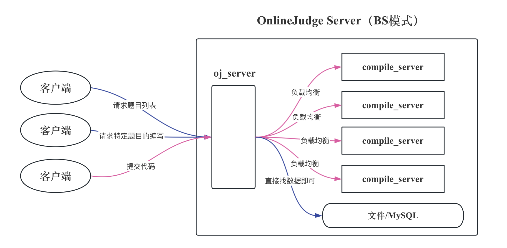

**如果客户只是请求题目列表、请求特定题目的编写，我们只需要直接找数据库就行了。**

**但是客户如果提交代码了，我们就要通过负载均衡分布式算法，找编译部分去做事情。**

### 3.3 编写顺序

1. 先编写compile_server
2. 然后编写oj_server
3. 编写version1：基于文件版本系统
4. 引入前端页面设计
5. 编写version2：基于数据库版本的系统

## 4. 编译服务设计

### 4.1 准备工作

提供的服务是：编译我们的代码，运行代码，得到格式化的结果。

先把要用的文件建立好。

```bash
yufc@ALiCentos7:~/Src/Bit-Project/online_judge/compile_server$ tree .
.
├── compiler.hpp
├── compile_run.hpp
├── compile_server.cc
├── makefile
└── runner.hpp

0 directories, 5 files
yufc@ALiCentos7:~/Src/Bit-Project/online_judge/compile_server$
```

我们现在先写`compiler.hpp`。

我们假设现在已经有一个源代码文件（临时文件），我们这个compiler.hpp去编译这个临时文件。

当然如果是要编译的话，无非就是两种结果。

1. 编译通过
2. 编译出错

因此我们编译出错之后，出错信息肯定需要一个临时文件来进行保存，但是本来就是放到显示器去的，但是现在需要展示给用户，这个工作叫做重定向！

另外，编译这个东西，肯定不是我们的进程去做的，肯定是要fork去做的。

所以我们可以画出编译服务这一部分的整体结构了。

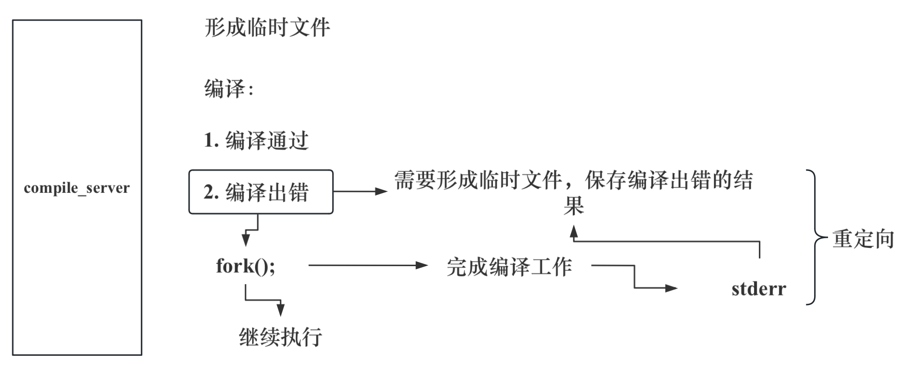

然后我们就可以开始写了。

### 4.2 主要结构编写

用一个核心的函数`static bool Compile(const std::string &file_name)`来进行编译的工作。

然后传入的就是我们说的临时文件

```cpp
#ifndef __YUFC_COMPILER_HPP__
#define __YUFC_COMPILER_HPP__
#include <iostream>
#include <algorithm>
#include <unistd.h>
// 只负责代码的编译
namespace ns_compiler
{
    class Compiler
    {
    public:
        Compiler() {}
        ~Compiler() {}
        static bool Compile(const std::string &file_name)
        {
            /*
                return value:
                true: 编译成功
                false: 编译失败
            */
            pid_t child_pro_pid = fork();
            if (child_pro_pid < 0)
            {
                return false; // 编译失败
            }
            else if (child_pro_pid == 0)
            {
                // 子进程: 调用编译器，完成对代码的编译工作
            }
          	// ...
        }
    };
}

#endif
```

然后调用子进程之后，用程序替换的方法去进行操作就行了。


因为我们只在这里调用`g++`肯定在系统路经底下的。所以肯定选择带p的。

这里我们选择`execlp`来进行程序替换即可。

好，现在的问题是，我们在编译过程中，肯定会产生大量的临时文件。比如到底是正确的源文件，还是错误信息，还是其他什么的，我们都要保存好，所以创建一个temp路经文件夹。

```bash
yufc@ALiCentos7:~/Src/Bit-Project/online_judge/compile_server$ mkdir temp
yufc@ALiCentos7:~/Src/Bit-Project/online_judge/compile_server$ tree .
.
├── compiler.hpp
├── compile_run.hpp
├── compile_server.cc
├── makefile
├── runner.hpp
└── temp

1 directory, 5 files
yufc@ALiCentos7:~/Src/Bit-Project/online_judge/compile_server$ 
```

```cpp
/*
    我们认为，传进来的file_name是没有后缀的
    所以: file_name: 1234
    1234 -> ./temp/1234.cpp
    1234 -> ./temp/1234.exe
    1234 -> ./temp/1234.stderr
*/
```

因此，我们可能涉及到字符串的一些操作，因此我们在comm的目录下创建`util.hpp`表示一些公用的工具。

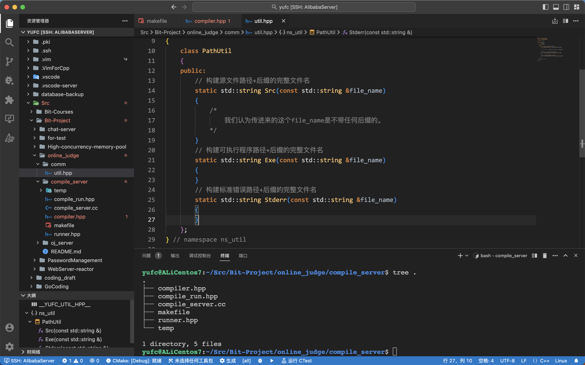

搞定之后，调用程序替换函数。

```cpp
execlp("g++", "-o", PathUtil::Exe(file_name).c_str(), PathUtil::Src(file_name), "-std=c++11", nullptr); // 不要忘记这个nullptr
```

现在我们就可以先把处理字符串的那几个工具先写了。

### 4.3 PathUtil工具编写

```cpp
namespace ns_util
{
    const std::string temp_path_root = "./temp/"; // 全剧路径
    class PathUtil
    {
    public:
        static std::string AddSuffix(const std::string &file_name, const std::string &suffix)
        {
            std::string path_name = temp_path_root;
            path_name += file_name;
            path_name += suffix;
            return path_name;
        }

    public:
        // 构建源文件路径+后缀的完整文件名
        static std::string Src(const std::string &file_name)
        {
            /*
                我们认为传进来的这个file_name是不带任何后缀的。
            */
            return AddSuffix(file_name, ".cpp");
        }
        // 构建可执行程序路径+后缀的完整文件名
        static std::string Exe(const std::string &file_name)
        {
            return AddSuffix(file_name, ".exe");
        }
        // 构建标准错误路径+后缀的完整文件名
        static std::string Stderr(const std::string &file_name)
        {
            return AddSuffix(file_name, ".stderr");
        }
    };
} // namespace ns_util
```

暂时先这样写着。

然后我们可以继续编写主结构。

### 4.4 继续编写主结构

现在`Compile`函数是这样的。

```cpp
static bool Compile(const std::string &file_name)
{
    /*
        return value:
        true: 编译成功
        false: 编译失败
    */
    /*
        我们认为，传进来的file_name是没有后缀的
        所以: file_name: 1234
        1234 -> ./temp/1234.cpp
        1234 -> ./temp/1234.exe
        1234 -> ./temp/1234.stderr
    */
    pid_t child_pro_pid = fork();
    if (child_pro_pid < 0)
    {
        return false; // 编译失败
    }
    else if (child_pro_pid == 0)
    {
        // 子进程: 调用编译器，完成对代码的编译工作
        // g++ -o target src -std=c++11
        execlp("g++", "-o", PathUtil::Exe(file_name).c_str(), \
               PathUtil::Src(file_name), "-std=c++11", nullptr); // 不要忘记这个nullptr
    }
  	else
    {
      	// ...
    }
}
```

我们继续编写，我们既然execpl了，我们要知道程序运行的结果，我们肯定要等啊。

我们调用`waitpid()`之后。

如何判断编译是否成功呢？

我么你可以通过判断文件是否存在的方式进行判断。

如果`1234.exe`存在，表明编译成功了。以此类推。

```cpp
else
{
    waitpid(child_pro_pid, nullptr, 0);
    // 编译是否成功？
    if(FileUtil::IsFileExists(PathUtil::Exe(file_name)))
    {
        return true;
    }
}
```

`IsFileExists`可以放到`Util`里面去管理。

```cpp
class FileUtil
{
public:
    static bool IsFileExists(const std::string &path_name) 
    {
    }
};
```

那如何判断文件是否存在呢，其实可以用打开文件的方式，如果文件打开成功，文件就存在，这个方式是可以的。但是这个方法比较捞，我们用另一个方法。

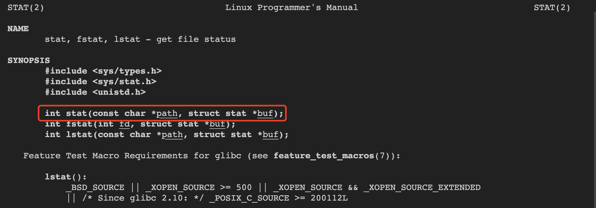

这个方法可以获取到一个路径下文件的属性。

`buf`是一个输出型参数，里面是文件的属性。我们不用管。

返回值是一个`int`，如果获取属性成功了，返回0，如果获取失败返回-1。

```cpp
class FileUtil
{
public:
    static bool IsFileExists(const std::string &path_name)
    {
        struct stat st;
        if (stat(path_name.c_str(), &st) == 0)
        {
            // 获取文件属性成功了
            return true;
        }
        return false;
    }
};
```

现在这里其实这一部分完成差不多了。

但是，如果有错误信息呢，我们要重定向错误信息，所以我们现在就做这一步。

原来错误信息就是要打印到2号文件描述符上的，现在重定向到我们的文件的文件描述符中去。

用`dup2()`就行。

```cpp
 else if (child_pro_pid == 0)
{
    // 重定向错误信息
    int fd_stderr = open(PathUtil::Stderr(file_name).c_str(), O_CREAT | O_WRONLY, 644);
    if (fd_stderr < 0)
    {
        exit(1);
    }
    // 重定向标准错误到 fd_stderr
    dup2(fd_stderr, 2);

    // 子进程: 调用编译器，完成对代码的编译工作
    // g++ -o target src -std=c++11
    execlp("g++", "g++", "-o", PathUtil::Exe(file_name).c_str(),
           PathUtil::Src(file_name).c_str(), "-std=c++11", nullptr); // 不要忘记这个nullptr
    exit(1);
}
```

**注意：程序替换不影响程序的文件描述符表。**

但是！我们出现错误之后，现在是直接返回的，但是我们按道理是要打日志的。所以下一章节，我们先把日志功能给写好。

## 5. 日志功能编写

这个和简单，很好理解，先上主体结构的代码。

```cpp
namespace ns_log
{
    using namespace ns_util;
    enum // 日志等级
    {
        INFO,
        DEBUG,
        WARNING,
        ERROR,
        FATAL
    };
    // Log() << "message"
    std::ostream &Log(const std::string &level, const std::string &file_name, int line)
    {
        // 添加日志等级
        std::string message = "[";
        message += level;
        message += "]";
        // 添加报错文件名称
        message += "[";
        message += file_name;
        message += "]";
        // 添加报错行
        message += "[";
        message += std::to_string(line);
        message += "]";
        // 日志时间戳
        message += "[";
        message += TimeUtil::GetTimeStamp();
        message += "]";

        // cout 本质内部是包含缓冲区的
        std::cout << message; // 不要endl进行刷新

        return std::cout;
    }
}
```

但是我们将来不想这样调用，传这么多参数，我们希望`LOG(level) << "hello"`这样就能调用了，因此我们定义一个宏。

```cpp
#define LOG(level) Log(#level, __FILE__, __LINE__);
```

然后获取时间的代码如下。

```cpp
class TimeUtil
{
public:
    static std::string GetTimeStamp()
    {
        struct timeval __time;
        gettimeofday(&__time, nullptr);
        return std::to_string(__time.tv_sec);
    }
};
```

这样就没问题了。

## 6. 运行功能

现在我们已经可以顺利得得到一个可执行了，那么现在我们肯定是要去执行这个可执行的。

```cpp
#ifndef __YUFC_RUNNER__
#define __YUFC_RUNNER__
#include <iostream>
#include <string>
namespace ns_runner
{
    class Runner
    {
    public:
        Runner() {}
        ~Runner() {}
    public:
        // 指名文件名即可，不需要带上路径，不需要带上路径
        static int Run(const std::string& file_name)
        {
            
        }
    };
}
#endif
```

首先肯定是要`fork()`的。

**一些要注意的点：**

> 程序运行完成之后：
>
> 1. 代码跑完，结果正确
>
> 2. 代码跑完，结果不正确
>
> 3. 代码没跑完，异常
>
> run需要考虑代码跑完，结果正确与否吗？不需要！
>
> 判断结果对不对，是由测试用例决定的！
>
> 所以这部分只考虑代码是否正确运行完毕
>
> 另外，我们必须知道，可执行程序是谁？
>
> 一个程序在默认启动的时候：
>
> - 标准输入：不处理，不考虑自测的情况
>
> - 标准输出：程序运行完成，输出结果是什么
>
> - 标准错误：运行时错误信息（区别编译错误信息）
>
> 我们希望，这三个输出，都可以重定向到文件中去

所以，我们要区分编译时的错误和运行时的错误。

所以刚才Util里面的Stderr重新改一下。

```cpp
static std::string CompilerError(const std::string &file_name)
{
    return AddSuffix(file_name, ".compile_error");
}
```

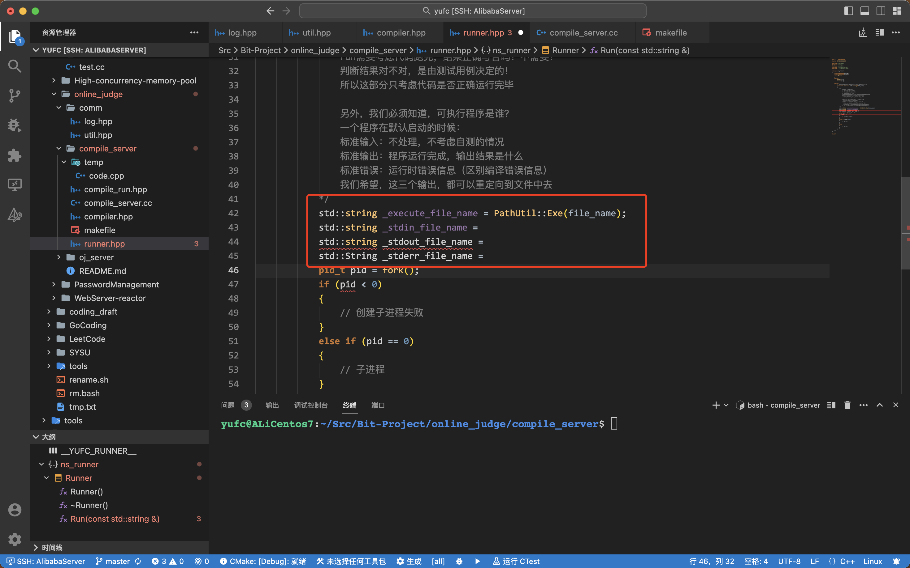

这里面我们需要打印运行时的信息，所以需要stdin, stdout, stderr的三个同名文件的日志文件。

所以PathUtil里面可以再加东西。


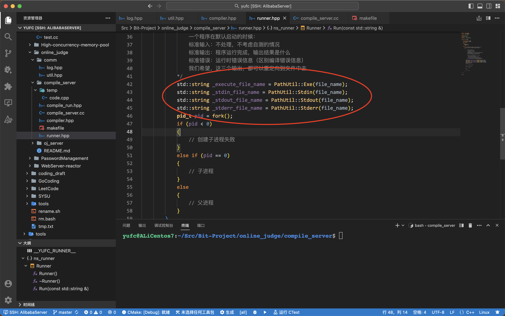

打开这几个文件

```cpp
// 打开这几个文件
umask(0);
int _stdin_fd = open(_stdin_file_name.c_str(), O_CREAT | O_RDONLY, 0777);
int _stdout_fd = open(_stdout_file_name.c_str(), O_CREAT | O_WRONLY, 0777);
int _stderr_fd = open(_stderr_file_name.c_str(), O_CREAT | O_WRONLY, 0777);
```

当然要保证文件打开成功。

```cpp
// 一定要保证打开成功
if (_stdin_fd < 0 || _stdout_fd < 0 || _stderr_fd < 0) 
{
    // LOG() << 
    return -1; // 代表打开文件失败
}
```

父进程是不关心的这些文件描述符的，然后父进程就是等就行了。

```cpp
else 
{
    // 父进程
    // 父进程不关注这些文件描述符
    close(_stdin_fd);
    close(_stdout_fd);
    close(_stderr_fd);
    int status = 0;
    waitpid(pid, &status, 0);
}
```

子进程。

```cpp
else if (pid == 0)
{
    // 子进程
    // 进行三个重定向
    dup2(_stdin_fd, 0);
    dup2(_stdout_fd, 1);   
    dup2(_stderr_fd, 2);   

    execlp(_execute_file_name.c_str(), _execute_file_name.c_str(), nullptr);
    exit(1); // 如果出错了就会到这里来，设置成1
}
```

但是现在有问题，我们如何知道系统是否遇到了异常呢？

程序出崩溃，肯定是收到了信号。

```cpp
else 
{
    // 父进程
    // 父进程不关注这些文件描述符
    close(_stdin_fd);
    close(_stdout_fd);
    close(_stderr_fd);
    int status = 0;
    waitpid(pid, &status, 0);
    // 程序运行异常，一定是因为收到了信号
    return status & 0x7F; // 这里最后返回的是获取到子进程的信号
}
```

```cpp
/*
    return value: status & 0x7F
    >0 表示程序发生了异常，子进程收到了信号
    返回值就是对应的信号编号！
    ==0 正常运行完毕，结果保存到了临时文件当中，是否跑过测试用例，不关心
    <0 内部错误（比如打开文件失败，创建子进程失败）
*/
```

把日志补上。

## 7. 测试运行模块

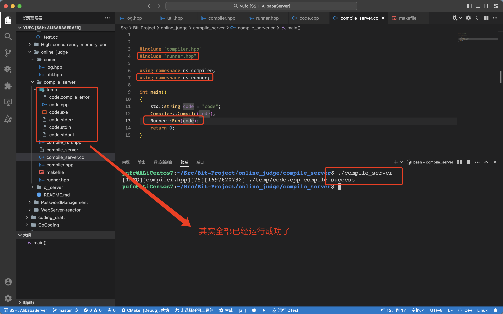

## 8. 初识资源限制

认识一个新的linux接口。


现在`comm`里面创建一个`test.cc`来学习这个接口。

### 8.1 限制时间

```cpp
#include <iostream>
#include <sys/time.h>
#include <sys/resource.h>
int main()
{
    // 限制运行时长
    struct rlimit r;
    r.rlim_cur = 1;
    r.rlim_max = RLIM_INFINITY;
    setrlimit(RLIMIT_CPU, &r);
    while(1)
    {
        ;
    }
    return 0;
}
```


### 8.2 限制内存大小

```cpp
int main()
{
    // 限制内存大小
    struct rlimit r;
    r.rlim_cur = 1024*1024*40; // 20M
    r.rlim_max = RLIM_INFINITY;
    setrlimit(RLIMIT_AS, &r);
    int count = 0;
    while (true)
    {
        int *p = new int[1024*1024]; // 一次申请1mb
        std::cout << "size: " << count++ << std::endl;
        sleep(1);
    }
    return 0;
}
```


### 8.3 进程时如何被终止的？

资源不足，导致OS终止进程，是通过信号终止的。

那我现在有点好奇，我这两份代码，分别会收到什么信号。

```cpp

#include <iostream>
#include <sys/time.h>
#include <sys/resource.h>
#include <unistd.h>
#include <signal.h>

void handler(int signo)
{
    std::cout <<"signo: " << signo << std::endl;
    exit(1);
}

int main()
{
    // 捕捉信号
    for (int i = 1; i <= 31; i++)
    {
        signal(i, handler);
    }
    // 限制运行时长
#if false
    struct rlimit r;
    r.rlim_cur = 1;
    r.rlim_max = RLIM_INFINITY;
    setrlimit(RLIMIT_CPU, &r);
    while(1)
    {
        ;
    }
#endif

    // 限制内存大小
    struct rlimit r;
    r.rlim_cur = 1024 * 1024 * 40; // 20M
    r.rlim_max = RLIM_INFINITY;
    setrlimit(RLIMIT_AS, &r);
    int count = 0;
    while (true)
    {
        int *p = new int[1024 * 1024]; // 一次申请1mb
        std::cout << "size: " << count++ << std::endl;
        sleep(1);
    }
    return 0;
}
```

我们看到，内存问题其实就是收到了6号信号。


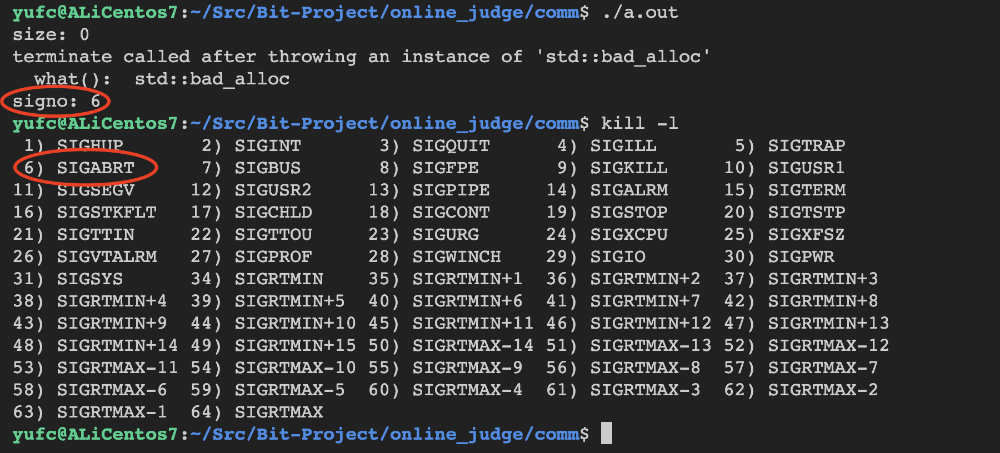

时间限制呢？

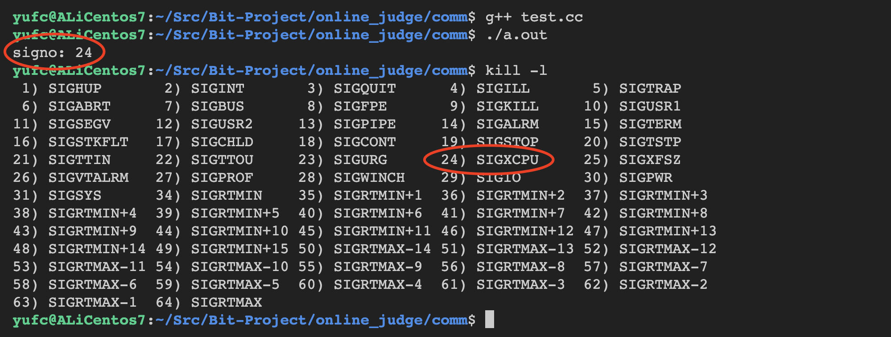

### 8.4 给runner设置资源限制

在这里设置限制

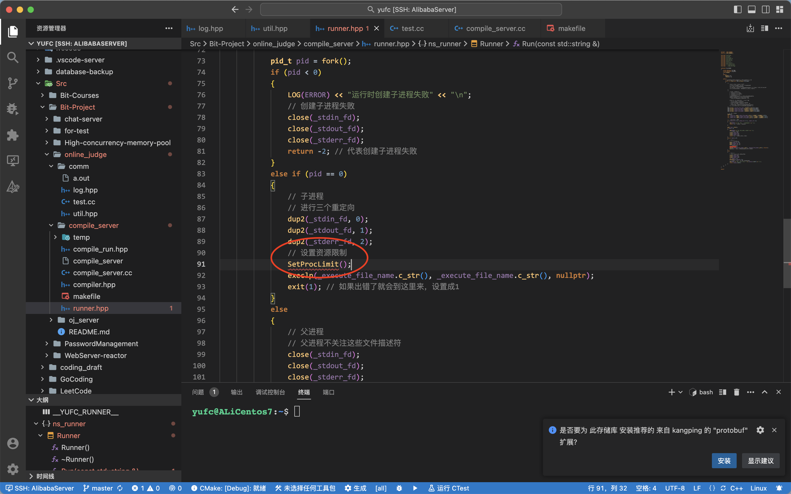

当然我们的`Run`方法，最好就是对外暴露，我们需要的限制。

所以改一下

```cpp
static int Run(const std::string &file_name, int cpu_limit, int mem_limit) {}
```

```cpp
static void SetProcLimit(int cpu_limit, int mem_limit)
{
    /* 提供设置进程占用资源大小的接口 */
    /* mem_limit 是 kb 单位 */
    struct rlimit cpu_rlimit;
    cpu_rlimit.rlim_max = RLIM_INFINITY;
    cpu_rlimit.rlim_cur = cpu_limit;
    setrlimit(RLIMIT_CPU, &cpu_rlimit);

    struct rlimit mem_rlimit;
    mem_rlimit.rlim_max = RLIM_INFINITY;
    mem_rlimit.rlim_cur = mem_limit * 1024; // 转化成kb
    setrlimit(RLIMIT_AS, &mem_rlimit);
}
```

## 9. complie_run模块编写

### 9.1 基本框架理解

这一模块除了结合compile和run之外，最重要的，是去适配用户请求。

而且要注意，这个模块是网络服务调用的，大量用户有可能会同时做同一个题目，所以此时我们要形成唯一的文件名。

另外`compile_server.cc`这个文件是不应该看到`compile`模块和`run`模块的，他只能看到`compile_run`模块，这样才是对的。

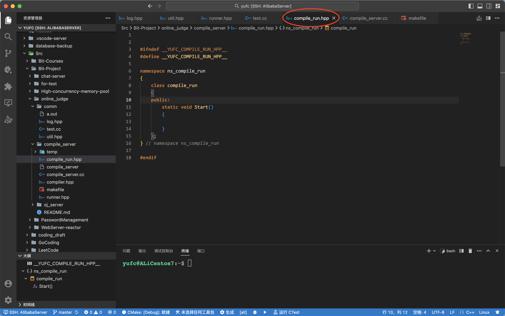

### 9.2 安装和认识jsoncpp

```bash
sudo yum install jsoncpp-devel -y
```

简单使用。

```cpp
#include <jsoncpp/json/json.h>
#include <string>
int main()
{
    // 序列化工作
    // Value 是一个Json的中间类，可以填充kv值
    Json::Value root;
    root["code"] = "mycode";
    root["user"] = "whb";
    root["age"] = "19";

    Json::StyledWriter writer;
    std::string str = writer.write(root);
    std::cout << str << std::endl;
    return 0;
}
```

要链接一个库来编译。

```bash
g++ test.cc -std=c++11 -ljsoncpp
```


### 9.3 cr模块-1

现在开始写start。

```cpp
/*
    输入参数:
        input: 用户给自己提交的代码对应的输入
        code: 用户提交的代码对应的输入，不做处理
        cpu_limit: 时间要求
        mem_limit: 空间要求
    输出参数:
        status: 状态码
        reason: 请求结果
        stdout: 我的程序运行完的结果
        stderr: 运行完的错误结果
*/
static void Start(const std::string &in_json, const std::string *out_json)
{
    Json::Value in_value;
    Json::Reader reader;
    reader.parse(in_json, in_value); // 最后再处理差错问题
    // 代码和输入
    std::string code = in_value["code"].asString();
    std::string input = in_value["input"].asString(); // 不做处理
    // 时间限制和空间限制
    int cpu_limit = in_value["cpu_limit"].asInt();
    int mem_limit = in_value["mem_limit"].asInt();


    if (code.size() == 0)
    {
        // 用户没有提交代码
        // ...
    }
    // 形成一个唯一文件名，然后把code写到临时文件里面去
    std::string file_name = FileUtil::UniqFileName();
    FileUtil::WriteFile(PathUtil::Src(file_name), code); // 形成临时src源文件
    //
    Compiler::Compile(file_name);
    Runner::Run(file_name, cpu_limit, mem_limit);
}
```

大概的骨架就是这样。但是这里还有很多要补充的，比如。

- 每一步出现问题，要做差错处理
- out还没开始构建

### 9.4 cr模块-2

输入和输出的json大概是这样的。

```cpp
/*
    in_json:
    {"code":"#include ...", "input":"", "cpu_limit":1, "mem_limit":10240}
    out_json:
    {"status":0, "reason":"", "stdout":"", "stderr":"", ...}
*/
```

现在我们要去补一些差错处理。

我们利用`goto`语句。

```cpp
static void Start(const std::string &in_json, const std::string *out_json)
{
    Json::Value in_value;
    Json::Reader reader;
    reader.parse(in_json, in_value); // 最后再处理差错问题
    // 代码和输入
    std::string code = in_value["code"].asString();
    std::string input = in_value["input"].asString(); // 不做处理
    // 时间限制和空间限制
    int cpu_limit = in_value["cpu_limit"].asInt();
    int mem_limit = in_value["mem_limit"].asInt();

    // 因为goto跳转的区间不能定义变量
    // 返回给上层的状态码
    int status_code = 0;
    // Run返回的状态码
    int runner_rt_code = 0;
    // 唯一的文件名
    std::string file_name;

    // 构建一个最终给用户返回的json
    Json::Value out_value;

    if (code.size() == 0)
    {
        status_code = -1; // 文件为空
        goto END;
    }
    // 形成一个唯一文件名，然后把code写到临时文件里面去
    // 这里到时候采用毫秒级时间戳+原子性递增唯一值：来保证唯一性
    file_name  = FileUtil::UniqFileName();
    if (!FileUtil::WriteFile(PathUtil::Src(file_name), code)) // 形成临时src源文件
    {
        status_code = -2; // 未知错误
        goto END;
    }
    if (!Compiler::Compile(file_name))
    {
        status_code = -3; // 编译错误
        goto END;
    }
    runner_rt_code = Runner::Run(file_name, cpu_limit, mem_limit);
    if (runner_rt_code < 0)
    {
        status_code = -2; // 未知错误
        goto END;
    }
    else if(runner_rt_code > 0)
    {
        status_code = runner_rt_code; // 程序运行崩溃
        goto END;
    }
    else 
    {
        status_code = 0;
    }
    END:
    out_value["status"] = status_code;
    out_value['reason'] = ;
    if(status_code == 0)
    {
        // 整个过程全部成功
        out_value["stdout"] = ;
        out_value["stderr"] = ;
    }
}
```

大概框架是这样的。

```cpp
static void Start(const std::string &in_json, std::string *out_json)
{
    Json::Value in_value;
    Json::Reader reader;
    reader.parse(in_json, in_value); // 最后再处理差错问题
    // 代码和输入
    std::string code = in_value["code"].asString();
    std::string input = in_value["input"].asString(); // 不做处理
    // 时间限制和空间限制
    int cpu_limit = in_value["cpu_limit"].asInt();
    int mem_limit = in_value["mem_limit"].asInt();

    // 因为goto跳转的区间不能定义变量
    // 返回给上层的状态码
    int status_code = 0;
    // Run返回的状态码
    int runner_rt_code = 0;
    // 唯一的文件名
    std::string file_name;

    // 构建一个最终给用户返回的json
    Json::Value out_value;

    if (code.size() == 0)
    {
        status_code = -1; // 文件为空
        goto END;
    }
    // 形成一个唯一文件名，然后把code写到临时文件里面去
    // 这里到时候采用毫秒级时间戳+原子性递增唯一值：来保证唯一性
    file_name = FileUtil::UniqFileName();
    if (!FileUtil::WriteFile(PathUtil::Src(file_name), code)) // 形成临时src源文件
    {
        status_code = -2; // 未知错误
        goto END;
    }
    if (!Compiler::Compile(file_name))
    {
        status_code = -3; // 编译错误
        goto END;
    }
    runner_rt_code = Runner::Run(file_name, cpu_limit, mem_limit);
    if (runner_rt_code < 0)
    {
        status_code = -2; // 未知错误
        goto END;
    }
    else if (runner_rt_code > 0)
    {
        status_code = runner_rt_code; // 程序运行崩溃
        goto END;
    }
    else
    {
        status_code = 0;
    }
END:
    out_value["status"] = status_code;
    out_value['reason'] = CodeToDesc(status_code);
    if (status_code == 0)
    {
        // 整个过程全部成功
        out_value["stdout"] = FileUtil::ReadFile(PathUtil::Stdout(file_name));
        out_value["stderr"] = FileUtil::ReadFile(PathUtil::Stderr(file_name));
    }
    Json::StyledWriter writer;
    *out_json = writer.write(out_value);
}
```

### 9.5 cr模块-3

完成刚刚需要的各个工具。

#### 9.5.1 `CodeToDesc()`

```cpp
static std::string CodeToDesc(int code)
{
    // 状态码 -> 对应的描述
    std::string desc;
    switch (code)
    {
    case 0:
        desc = "编译运行成功";
        break;
    case -1:
        desc = "用户提交的代码是空";
        break;
    case -2:
        desc = "未知错误";
        break;
    case -3:
        desc = "编译时发生了错误";
        break;
    case SIGABRT:
        desc = "内存超过范围";
        break;
    case SIGXCPU:
        desc = "cpu使用超时";
        break;
    case SIGFPE:
        desc = "浮点数溢出";
        break;
    default:
        desc = "未知错误(code: " + std::to_string(code) + ")";
        break;
    }
    return desc;
}
```

后续遇到了什么其他的，可以直接在里面加就行了。

#### 9.5.2 `UniqFileName()`

```cpp
static std::string UniqFileName()
{
    // 定义一个C++11库 #include <atomic> 里面提供的一个原子性的计数器
    static std::atomic_uint id(0); // 这里要static，避免每次调用它都重新定义这个id
    id++;
    // 毫秒级时间戳+原子性递增唯一值：来保证唯一性
    std::string ms = TimeUtil::GetTimeMs(); // 得到毫秒级时间戳
    std::string uniq_id = std::to_string(id);
    return ms + "." + uniq_id;
}
```

#### 9.5.3 `WriteFile()`和`ReadFile()`

```cpp
static bool WriteFile(const std::string &target, const std::string &content)
{
    std::ofstream out(target);
    if (!out.is_open())
    {
        return false;
    }
    out.write(content.c_str(), content.size());
    out.close();
    return true;
}
static bool ReadFile(const std::string &target, std::string *content, bool keep = false)
{
    /*
        keep == false 表示不保留每一行的 "\n" 
    */
    (*content).clear();
    std::ifstream in(target);
    if (!in.is_open())
    {
        return false;
    }
    std::string line;
    // getline不保存行分隔符 -- 这里有坑
    // getline 有些时候是需要保留\n的
    while (std::getline(in, line))
    {
        (*content) += line;
        (*content) += (keep) ? "\n" : "";
    }
    in.close();
    return true;
}
```

然后我们`ReadFile()`改成这种结果从参数输出出去的形式之后，cr里面的读文件也要改一下了。

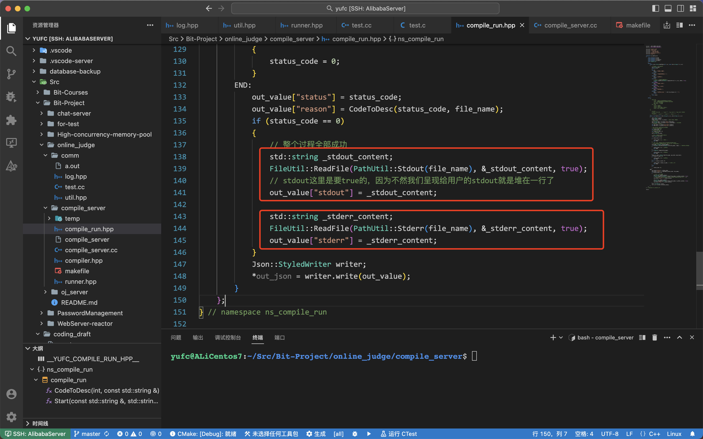

### 9.6 对代码进行测试

先直接`make clean;make` 编译一下，看看有没有编译问题先。

然后我们要来开始弄一个测试的方法了。

在`compile_server.cc`里面。

```cpp
#include "compile_run.hpp"
using namespace ns_compile_run;
int main()
{
    std::string in_json;
    Json::Value in_value;
    in_value["code"] = "";
    in_value["input"] = "";
    in_value["cpu_limit"] = 1;
    in_value["mem_limit"] = 10240 * 3;
    
    Json::FastWriter writer;
    in_json = writer.write(in_value);
    std::cout << in_json << std::endl; // 先看看结果是啥样的先
    // compile_run::Start();
    return 0;
}
```

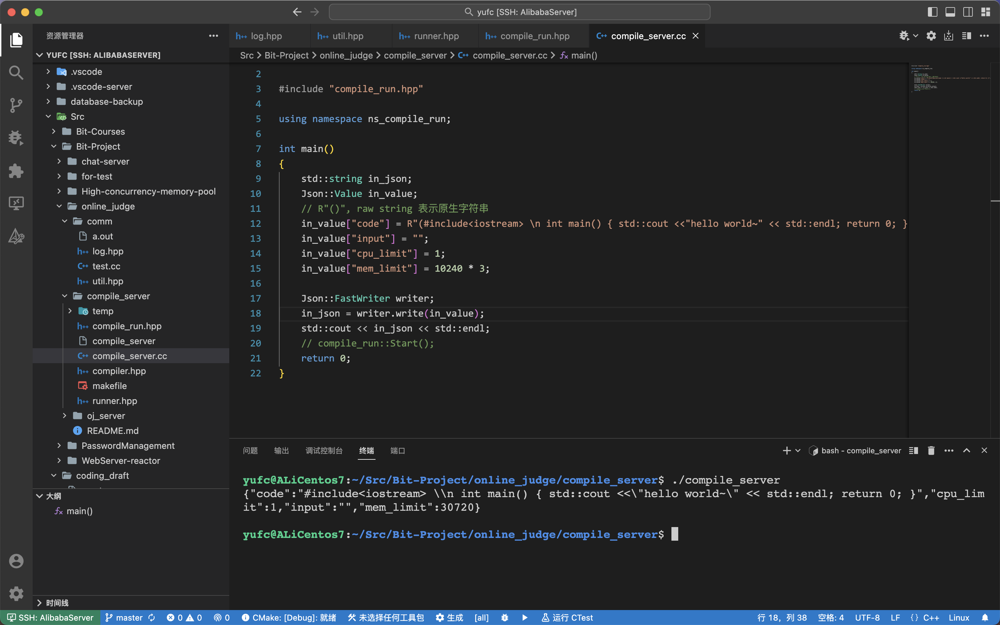

介绍一下C++11的一个工具，原生字符串。

`R"()"` raw string

因为我们code里面肯定有很多特殊字符。

这样写才是对的，上面这个还是有一些小问题。然后我们就运行成功了。


我们可以通过改这个里面临时的代码，去复现和测试各种错误。

### 9.7 收尾工作

我们产生的临时文件还是需要清理一下的。

```cpp
static void RemoveTempFile(const std::string &file_name)
{
    // 清理文件的个数是不确定，但是有哪些我们是知道的？
    std::string src_file_name = PathUtil::Src(file_name);
    if (FileUtil::IsFileExists(src_file_name))
        unlink(src_file_name.c_str());
    std::string compiler_error_file_name = PathUtil::CompilerError(file_name);
    if (FileUtil::IsFileExists(compiler_error_file_name))
        unlink(compiler_error_file_name.c_str());

    std::string execute_file_name = PathUtil::Exe(file_name);
    if (FileUtil::IsFileExists(execute_file_name))
        unlink(execute_file_name.c_str());

    std::string stdin_file_name = PathUtil::Stdin(file_name);
    if (FileUtil::IsFileExists(stdin_file_name))
        unlink(stdin_file_name.c_str());

    std::string stdout_file_name = PathUtil::Stdout(file_name);
    if (FileUtil::IsFileExists(stdout_file_name))
        unlink(stdout_file_name.c_str());

    std::string stderr_file_name = PathUtil::Stderr(file_name);
    if (FileUtil::IsFileExists(stderr_file_name))
        unlink(stderr_file_name.c_str());
}
```

其实感觉可以用程序替换，替换一个rm的脚本，感觉也可以。

### 9.8 形成网络服务

#### 9.8.1 cpp-httplib第三方网络库

这个库用起来很简单，他这个库是header-only的，只需要把.h拷贝过来就行了，很简单。

注意，用这个库需要把gcc/g++升级到 7,8,9 这些高版本上，不然用不了。

```bash
yufc@ALiCentos7:~/Src/Bit-Project/online_judge/comm$ gcc --version
gcc (GCC) 8.3.1 20190311 (Red Hat 8.3.1-3)
Copyright (C) 2018 Free Software Foundation, Inc.
This is free software; see the source for copying conditions.  There is NO
warranty; not even for MERCHANTABILITY or FITNESS FOR A PARTICULAR PURPOSE.
yufc@ALiCentos7:~/Src/Bit-Project/online_judge/comm$ 
```

简单使用。


先解决一下中文乱码问题。

这样就行了。

```cpp
svr.Get("/hello", [](const Request &req, Response &resp) {
    resp.set_content("hello httplib, 你好", "text/plain;charset=utf-8;");
});
```

#### 9.8.2 建立Post方法

```cpp
svr.Post("/compile_and_run", [](const Request &req, Response &resp)
         {
    // 用户请求的正文，就是我们想要的json string
    std::string in_json = req.body;
    std::string out_json;
    if (!in_json.empty())
    {
        compile_run::Start(in_json, &out_json);
        resp.set_content(out_json, "application/json;charset=utf-8");
    } });
```

这个很好理解，没啥好说的。因为用户过来的请求其实就是cr模块想要的json串。

#### 9.8.3 使用postman进行综合测试

可以采用postman进行测试，百度下载一下。

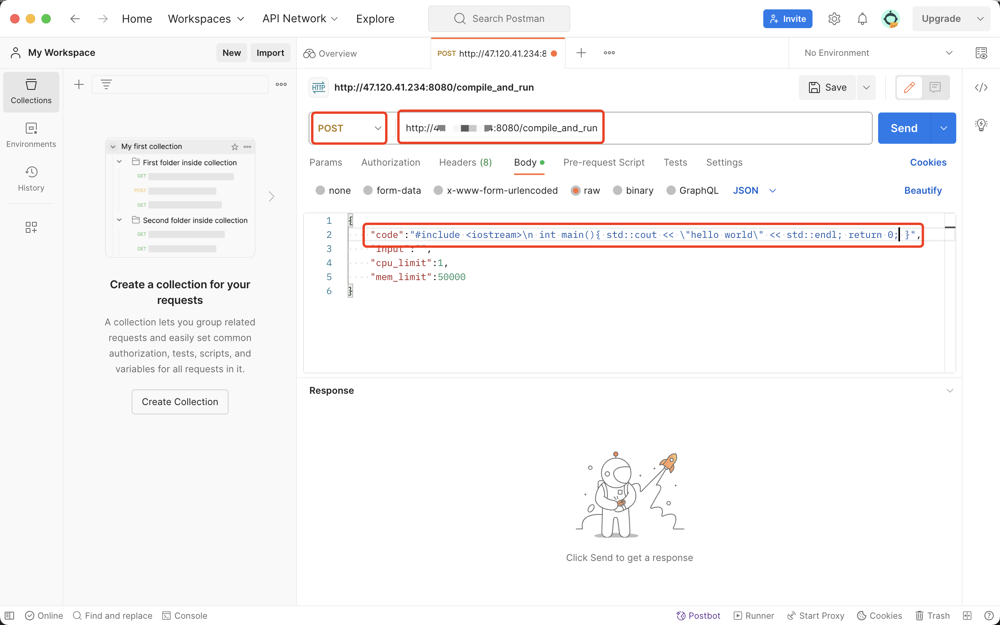

搞定了。

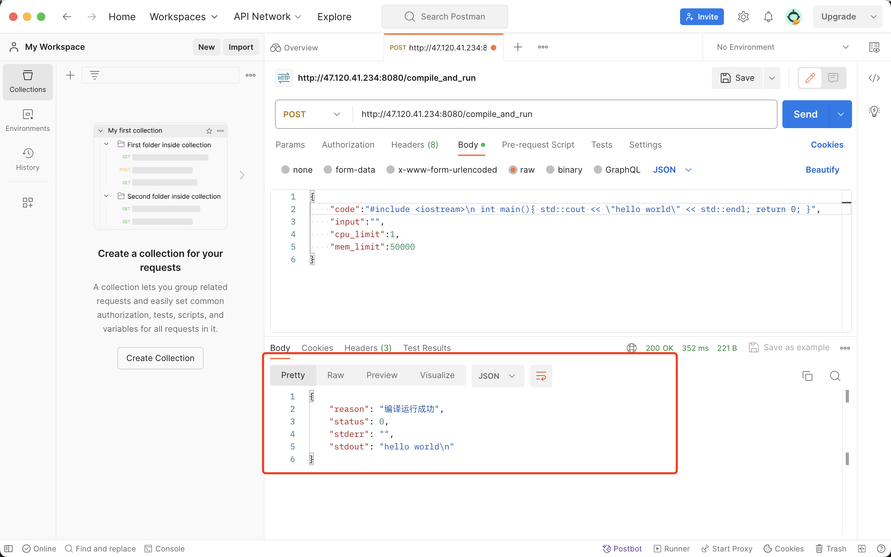

但是现在还有一个问题，以为到时候访问compile_run模块的是oj_server模块，因此我们不想把端口号写死，所以我们希望用命令行参数调用这个cr模块。

```cpp
#include "compile_run.hpp"
#include "../comm/httplib.h"
using namespace ns_compile_run;
using namespace httplib;
void Usage(std::string proc)
{
    std::cerr << "Usage: "
              << "\n\t" << proc << " port" << std::endl;
}

int main(int argc, char *argv[])
{
    if (argc != 2)
    {
        Usage(argv[0]);
        return 1;
    }
    Server svr;
#if false
    svr.Get("/hello", [](const Request &req, Response &resp)
            { resp.set_content("hello httplib, 你好", "text/plain;charset=utf-8;"); });
#endif
    svr.Post("/compile_and_run", [](const Request &req, Response &resp)
             {
        // 用户请求的正文，就是我们想要的json string
        std::string in_json = req.body;
        std::string out_json;
        if (!in_json.empty())
        {
            compile_run::Start(in_json, &out_json);
            resp.set_content(out_json, "application/json;charset=utf-8");
        } });

    svr.listen("0.0.0.0", atoi(argv[1])); // 启动http服务

    return 0;
}
```

至此，编译模块搞定！

## 10. oj_server准备工作

### 10.1 oj_server准备工作

**本质：写一个网站**

1. 获取首页，这里我们用用题目列表充当首页

2. 编辑区域页面

3. 提交判题功能

**MVC结构**

M：Model，通常是和数据交互的模块，比如，对题库进行增删查改（文件版/Mysql版）

V：View，通常是拿到数据之后，要进行构建网页，渲染网页内容，展示给用户的（浏览器）

C：Control，控制器，就是我们的核心业务逻辑

### 10.2 把文件目录准备好

```bash
yufc@ALiCentos7:~/Src/Bit-Project/online_judge/oj_server$ ls
yufc@ALiCentos7:~/Src/Bit-Project/online_judge/oj_server$ touch oj_server.cc
yufc@ALiCentos7:~/Src/Bit-Project/online_judge/oj_server$ touch oj_view.hpp
yufc@ALiCentos7:~/Src/Bit-Project/online_judge/oj_server$ touch oj_model.hpp
yufc@ALiCentos7:~/Src/Bit-Project/online_judge/oj_server$ touch oj_control.hpp
yufc@ALiCentos7:~/Src/Bit-Project/online_judge/oj_server$ tree .
.
├── oj_control.hpp
├── oj_model.hpp
├── oj_server.cc
└── oj_view.hpp

0 directories, 4 files
yufc@ALiCentos7:~/Src/Bit-Project/online_judge/oj_server$
```

### 10.3 先把网络路由功能写好

```cpp
#include <iostream>
#include "../comm/httplib.h"
using namespace httplib;

int main()
{
    // 用户请求的路由功能
    Server svr;
    // 获取所有题目的列表
    svr.Get("/all_questions", [](const Request &req, Response &resp) {
        resp.set_content("这是所有题目的列表", "text/plain; charset=utf-8");
    });
    // 用户要根据题目编号获取题目的内容
    // /question/100  ->  正则匹配
    svr.Get(R"(/question/(\d+))", [](const Request &req, Response &resp){
        std::string number = req.matches[1]; // 这里可以得到正则表达式获取到的东西
        // 感兴趣可以研究一下
        resp.set_content("这是指定的一道题: " + number, "text/plain; charset=utf-8");
    });
    // 用户提交
    svr.Get(R"(/judge/(\d+))", [](const Request &req, Response &resp){
        std::string number = req.matches[1];
        resp.set_content("这是指定题目的判题: " + number, "text/plain; charset=utf-8");
    });

    svr.listen("0.0.0.0", 8080);
    return 0;
}
```

具体的响应我们导师后可以再去补充。

### 10.4 设计题库（文件版）

> 1. 题目的编号
> 2. 题目的标题
> 3. 题目的难度
> 4. 题目的描述，题面
> 5. 时间要求（内部处理）
> 6. 空间要求（内部处理）

两批文件构成

1. question.list : 题目列表（不需要题目的内容）
2. 题目的描述，题目的预设置代码（header.cpp），测试用例代码（tail.cpp）

这两个内容是通过题目的编号产生关联的。

```bash
yufc@ALiCentos7:~/Src/Bit-Project/online_judge/oj_server/questions$ tree .
.
├── 1
│   ├── desc.txt
│   ├── header.cpp
│   └── tail.cpp
└── question.list

1 directory, 4 files
yufc@ALiCentos7:~/Src/Bit-Project/online_judge/oj_server/questions$ 
```

**`question.list`**

```
1 判断回文数 简单 ? 1 30000
...
...
```

**`./1/desc.txt`**

```
判断一个整数是否是回文数。回文数是指正序（从左向右）和倒序（从右向左）读都是一样的整数。

示例1:
输入: 121
输出: true

示例2:
输入: -121
输出: false
解释: 从左向右读，为-121。从右向左读，为121-。因此它不是一个回文数。

示例3:
输入: 10
输出: false
解释: 从左向右读，为01。因此不是一个回文数

进阶:
你能不将整数转为字符串来解决这个问题吗?
```

**`./1/header.cpp`**

```cpp
#include <iostream>
#include <string>
#include <vector>
#include <map>
#include <algorithm>
using namespace std;


class Solution
{
public:
    bool isPalindrome(int x)
    {
        // write code here
        return true;
    }
};
```

展示给用户的。

**`./1/tail.cpp`**

```cpp

#ifndef COMPILER_ONLINE
#include "header.cpp" // 为了让我们写的时候有提示
#endif

void Test1()
{
    // 通过定义临时对象，来完成方法的调用
    bool ret = Solution().isPalindrome(121);
    if (ret)
    {
        std::cout << "通过用例1, 测试121通过 ... OK!" << std::endl;
    }
    else
    {
        std::cout << "没有通过用例1, 测试的值是: 121" << std::endl;
    }
}
void Test2()
{
    // 通过定义临时对象，来完成方法的调用
    bool ret = Solution().isPalindrome(-10);
    if (!ret)
    {
        std::cout << "通过用例2, 测试-10通过 ... OK!" << std::endl;
    }
    else
    {
        std::cout << "没有通过用例2, 测试的值是: -10" << std::endl;
    }
}
int main()
{
    Test1();
    Test2();
    return 0;
}
```

下面这段代码我们是希望后面裁剪掉的，因为这一段代码仅仅只是为了我们开发的时候不要有这么多红色波浪号而已。

```cpp
#ifndef COMPILER_ONLINE
#include "header.cpp" // 为了让我们写的时候有提示
#endif
```

编译的时候`g++ -D COMPILER_ONLINE`带上这个宏即可。

## 11. 构建model部分代码

### 11.1 搭建model的框架

先搭建出框架。

```cpp
#ifndef __YUFC_OJ_MODEL_HPP__
#define __YUFC_OJ_MODEL_HPP__

#include <iostream>
#include <string>
#include <unordered_map>
#include <cassert>
#include <vector>
#include "../comm/log.hpp"

// 根据 question.list 文件，加载所有的题目信息到内存中
// model: 主要用来和数据进行交互，对外提供访问数据的接口

namespace ns_model
{
    using namespace ns_log;
    struct Question
    {
    public:
        std::string __number; // 题目编号（唯一的）
        std::string __title;  // 题目的标题
        std::string __star;   // 题目的难度 // 简单/中等/困难
        int __cpu_limit;      // 题目时间要求
        int __mem_limit;      // 题目的空间要求
        std::string __desc;   // 题目的描述
        std::string __header; // 预设的代码
        std::string __tail;   // 题目的测试用例，需要和header拼接，形成完整的代码
    };

    const std::string question_list_root = "./questions/question.list";

    class Model
    {
    private:
        std::unordered_map<std::string, Question> __questions;

    public:
        Model()
        {
            assert(LoadQuestionList());
        }
        ~Model() {}

    public:
        bool LoadQuestionList(const std::string &question_list)
        {
            /*
                加载配置文件: questions/question.list + 题目编号文件
            */
        }
        void GetAllQuestions(std::vector<Question> *out)
        {
        }
        void GetOneQuestions(const std::string &number, Question *q)
        {
        }
        
    };
};
#endif
```

### 11.2 编写model代码

`GetAllQuestions`和`GetOneQuestions`很简单，直接写。

```cpp
bool GetAllQuestions(std::vector<Question> *out)
{
    if (__questions.size() == 0)
    {
        return false;
    }
    for (const auto &q : __questions)
    {
        out->push_back(q.second); // 把哈希的丢到vector里面去
    }
    return true;
}
bool GetOneQuestions(const std::string &number, Question *q)
{
    const auto &iter = __questions.find(number);
    if (iter == __questions.end())
    {
        return false;
    }
    (*q) = iter->second;
    return true;
}
```

切分字符串的工具。

```cpp
class StringUtil
{
public:
    static void SplitString(const std::string &str, std::vector<std::string>* target, std::string sep)
    {
        /*  
            str: 要切分的字符串
            target: 输出结果
            sep: 指定的分割符
        */

    }
};
```

model模块整体代码。

```cpp


#ifndef __YUFC_OJ_MODEL_HPP__
#define __YUFC_OJ_MODEL_HPP__

#include <iostream>
#include <string>
#include <unordered_map>
#include <cassert>
#include <vector>
#include <fstream>
#include <stdlib.h>
#include "../comm/log.hpp"
#include "../comm/util.hpp"

// 根据 question.list 文件，加载所有的题目信息到内存中
// model: 主要用来和数据进行交互，对外提供访问数据的接口

namespace ns_model
{
    using namespace ns_log;
    using namespace ns_util;

    struct Question
    {
    public:
        std::string __number; // 题目编号（唯一的）
        std::string __title;  // 题目的标题
        std::string __star;   // 题目的难度 // 简单/中等/困难
        int __cpu_limit;      // 题目时间要求
        int __mem_limit;      // 题目的空间要求
        std::string __desc;   // 题目的描述
        std::string __header; // 预设的代码
        std::string __tail;   // 题目的测试用例，需要和header拼接，形成完整的代码
    };

    const std::string question_list_root = "./questions/question.list";
    const std::string question_path = "./questions/";
    class Model
    {
    private:
        std::unordered_map<std::string, Question> __questions;

    public:
        Model()
        {
            assert(LoadQuestionList(question_list_root));
        }
        ~Model() {}

    public:
        bool LoadQuestionList(const std::string &question_list)
        {
            /*
                加载配置文件: questions/question.list + 题目编号文件
            */

            std::ifstream in(question_list);
            if (!in.is_open())
            {
                LOG(FATAL) << "加载题库失败，请检查是否存在题库文件"
                           << "\n";
                return false;
            }
            // 按行读取
            std::string line;
            while (std::getline(in, line))
            {
                // 以空格为分割符
                // 切分字符串
                std::vector<std::string> tokens;
                StringUtil::SplitString(line, &tokens, " ");
                if (tokens.size() != 5) // 说明切分有问题
                {
                    LOG(WARNING) << "加载部分题目失败，请检查文件格式"
                                 << "\n";
                    continue;
                }
                Question q;
                q.__number = tokens[0];
                q.__title = tokens[1];
                q.__star = tokens[2];
                q.__cpu_limit = atoi(tokens[3].c_str());
                q.__mem_limit = atoi(tokens[4].c_str());

                std::string question_number_path = question_path;
                question_number_path += q.__number;
                question_number_path += "/";

                FileUtil::ReadFile(question_number_path + "desc.txt", &(q.__desc), true);
                FileUtil::ReadFile(question_number_path + "header.cpp", &(q.__header), true);
                FileUtil::ReadFile(question_number_path + "tail.cpp", &(q.__tail), true);

                __questions.insert({q.__number, q}); // 插入到哈希表中
            }
            LOG(INFO) << "记载题库 ... 成功！"
                      << "\n";
            in.close();
        }
        bool GetAllQuestions(std::vector<Question> *out)
        {
            if (__questions.size() == 0)
            {
                LOG(ERROR) << "用户获取题库失败"
                           << "\n";
                return false;
            }
            for (const auto &q : __questions)
            {
                out->push_back(q.second); // 把哈希的丢到vector里面去
            }
            return true;
        }
        bool GetOneQuestions(const std::string &number, Question *q)
        {
            const auto &iter = __questions.find(number);
            if (iter == __questions.end())
            {
                LOG(ERROR) << "用户获取题目失败，题目编号: " << number << "\n";
                return false;
            }
            (*q) = iter->second;
            return true;
        }
    };
};

#endif
```

### 11.3 安装boost库

我们有一个字符串切割的方法还没写，我们打算用boost库来写。

```bash
sudo yum install -y boost-devel
```

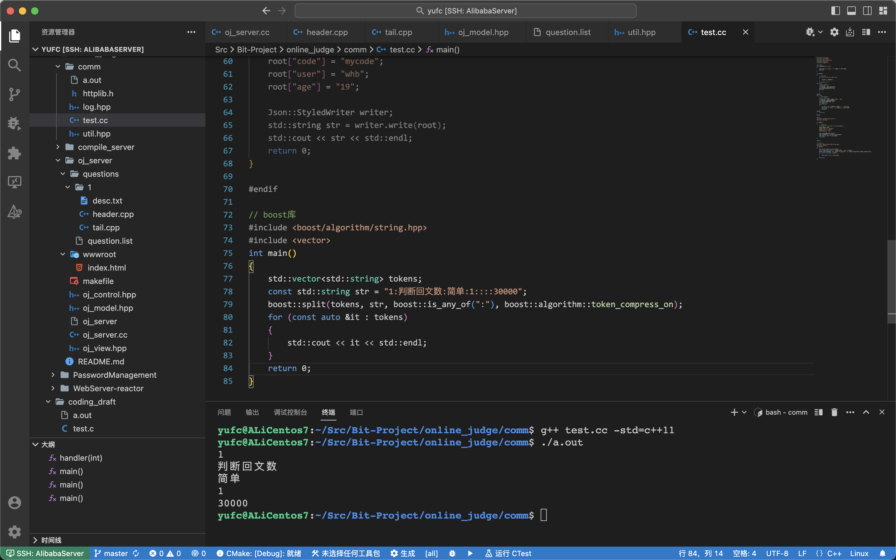

### 11.4 使用boost库来完成字符串切割方法

```cpp
static void SplitString(const std::string &str, std::vector<std::string> *target, const std::string &sep)
{
    /*
        str: 要切分的字符串
        target: 输出结果
        sep: 指定的分割符
    */
    // boost 库
    boost::split((*target), str, boost::is_any_of(sep), boost::algorithm::token_compress_on);
}
```

一句话搞定。

## 12. 编写control模块的基础结构

先把基础结构写了。

```cpp
#ifndef __YUFC_OJ_CONTROL_HPP__
#define __YUFC_OJ_CONTROL_HPP__
#include <iostream>
#include <string>
#include "./oj_model.hpp"
#include "../comm/log.hpp"
#include "../comm/util.hpp"
namespace ns_control
{
    using namespace ns_log;
    using namespace ns_util;
    using namespace ns_model;

    class Control
    {
    private:
        Model __model;
    public:
        
    };
} // namespace ns_control
#endif
```

然后我们cc文件是如何调用的呢？

是这样调用的。

```cpp
int main()
{
    // 用户请求的路由功能
    Server svr;
    Control ctrl;

    // 获取所有题目的列表
    svr.Get("/all_questions", [&ctrl](const Request &req, Response &resp)
            {
        // 这里我想返回一张包含所以题目列表信息的html网页
        std::string html;
        ctrl.AllQuestions(&html);

        resp.set_content(html, "text/html; charset=utf-8"); });
  	// ...
  	return 0;
}
```

然后control的结构就变成这样了。

```cpp


#ifndef __YUFC_OJ_CONTROL_HPP__
#define __YUFC_OJ_CONTROL_HPP__

#include <iostream>
#include <string>
#include <vector>

#include "./oj_model.hpp"
#include "../comm/log.hpp"
#include "../comm/util.hpp"

namespace ns_control
{
    using namespace ns_log;
    using namespace ns_util;
    using namespace ns_model;

    class Control
    {
    private:
        Model __model;

    public:
        // 根据题目数据构建网页 html是输出型参数
        bool AllQuestions(std::string *html)
        {
            std::vector<Question> all;
            if (this->__model.GetAllQuestions(&all))
            {
                // 获取题目信息成功，将所有题目数据构建成网页
            }
            else
            {
            }
        }
        bool Question(const std::string &number, std::string *html)
        {
            Question q;
            if (__model.GetOneQuestions(number, &q))
            {
                // 获取指定题目成功
            }
            else
            {
            }
        }
    };
} // namespace ns_control

#endif
```

## 13. 认识ctemplate前端渲染库

### 13.1 安装ctemplate

```url
https://github.com/OlafvdSpek/ctemplate
```

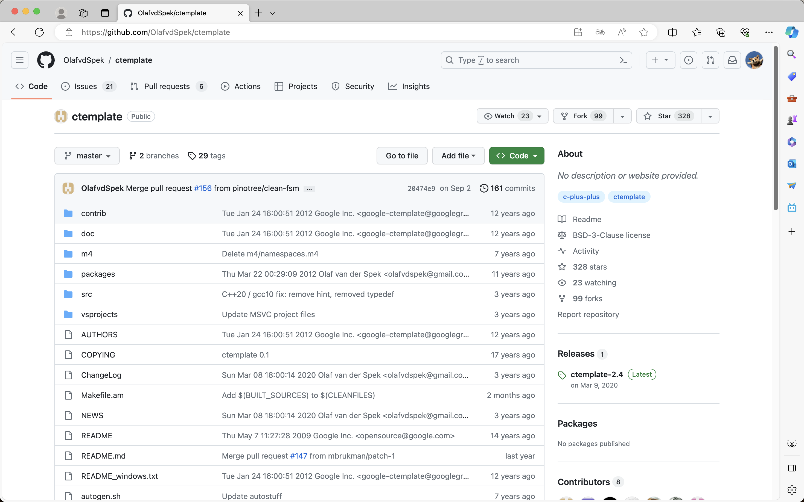

我自己的机子我装在这个地方。


进入这个文件夹。

运行这个命令。

```bash
./autogen.sh
```

然后运行这个命令。

```bash
./configure
```

然后运行这个命令。

```bash
make
```

然后运行这个命令。

```bash
sudo make install
```

### 13.2 基本使用

需要两个东西

1. 保存数据的数据字典
2. 待被渲染的网页内容

**`test.cc`**

```cpp

#include <iostream>
#include <sys/time.h>
#include <sys/resource.h>
#include <unistd.h>
#include <signal.h>

#include <ctemplate/template.h>

int main()
{
    std::string in_html = "./test.html";
    std::string value = "bitejiuyeke";

    // 形成数据字典
    ctemplate::TemplateDictionary root("test"); // 类似unordered_map
    root.SetValue("key", value);                // test.insert({})

    // 获取被渲染网页对象
    ctemplate::Template *tpl = ctemplate::Template::GetTemplate(in_html, ctemplate::DO_NOT_STRIP);

    // 添加字典数据到网页中
    std::string out_html;
    tpl->Expand(&out_html, &root);
    std::cout << out_html << std::endl;
    return 0;
}
```

**`test.html`**

```html
<!DOCTYPE html>
<html lang="en">
<head>
    <meta charset="UTF-8">
    <meta name="viewport" content="width=device-width, initial-scale=1.0">
    <title>用来测试</title>
</head>
<body>
    <p>{{key}}</p>
    <p>{{key}}</p>
    <p>{{key}}</p>
    <p>{{key}}</p>
</body>
</html>
```

所以的key就会被替换。

此时运行可执行可能会遇到问题。

```bash
./test: error while loading shared libraries: libctemplate.so.3: cannot open shared object file: No such file or directory
```

此时添加环境变量即可。

```bash
export LD\_LIBRARY\_PATH=$LD\_LIBRARY\_PATH:/usr/local/lib
```

也可以丢到`~/.bash_profile`里面去也是可以的。

### 13.3 编写view模块

先补充一下control模块的调用。

```cpp
class Control
{
private:
    Model __model;
    View __view;
public:
    // 根据题目数据构建网页 html是输出型参数
    bool AllQuestions(std::string *html)
    {
        bool ret = true;
        std::vector<struct Question> all;
        if (this->__model.GetAllQuestions(&all))
        {
            // 获取题目信息成功，将所有题目数据构建成网页
            __view.AllExpandHtml(all, html);
        }
        else
        {
            *html = "获取网页失败，获取题目列表失败";
            ret = false;
        }
        return ret;
    }
    bool Question(const std::string &number, std::string *html)
    {
        bool ret = true;
        struct Question q;
        if (__model.GetOneQuestions(number, &q))
        {
            // 获取指定题目成功
            __view.OneExpandHtml(q, html);
        }
        else
        {
            *html = "指定题目, 编号: " + number + " 不存在";
            ret = false;
        }
        return ret;
    }
};
```

**然后我们就要去写`View`模块的`AllExpandHtml`和`OneExpandHtml`模块。**

```cpp

#ifndef __YUFC_OJ_VIEW_HPP__
#define __YUFC_OJ_VIEW_HPP__

#include <iostream>
#include <string>
#include <ctemplate/template.h>

#include "./oj_model.hpp"

namespace ns_view
{
    using namespace ns_model;

    /*
        struct Question
        {
        public:
            std::string __number; // 题目编号（唯一的）
            std::string __title;  // 题目的标题
            std::string __star;   // 题目的难度 // 简单/中等/困难
            int __cpu_limit;      // 题目时间要求
            int __mem_limit;      // 题目的空间要求
            std::string __desc;   // 题目的描述
            std::string __header; // 预设的代码
            std::string __tail;   // 题目的测试用例，需要和header拼接，形成完整的代码
        };
    */

    class View
    {
    public:
        View() {}
        ~View() {}

    public:
        void AllExpandHtml(const std::vector<struct Question> questions, std::string *html)
        {
        }
        void OneExpandHtml(const struct Question &q, std::string *html)
        {
        }
    };
}

#endif
```

### 13.4 准备一些前端文件


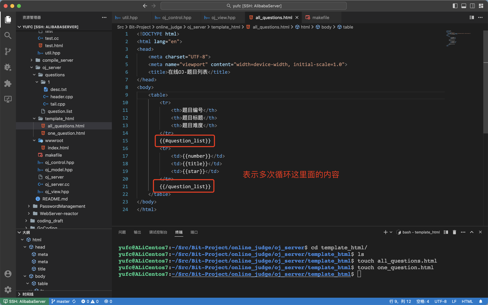

### 13.5 获取题目列表

```cpp
void AllExpandHtml(const std::vector<struct Question> questions, std::string *html)
{
    // 1. 形成路径
    std::string src_html = template_path + "all_questions.html";
    // 2. 形成数据字典
    ctemplate::TemplateDictionary root("all_questions");
    for (const auto &q : questions)
    {
        ctemplate::TemplateDictionary *sub = root.AddSectionDictionary("question_list");
        sub->SetValue("number", q.__number);
        sub->SetValue("title", q.__title);
        sub->SetValue("star", q.__star);
    }
    // 3. 获取被渲染的html
    ctemplate::Template *tpl = ctemplate::Template::GetTemplate(src_html, ctemplate::DO_NOT_STRIP);

    // 4. 执行渲染
    tpl->Expand(html, &root);
}
```


### 13.6 获取单个题目

```cpp
void OneExpandHtml(const struct Question &q, std::string *html)
{
    std::string src_html = template_path + "one_question.html";
    ctemplate::TemplateDictionary root("one_question");
    root.SetValue("number", q.__number);
    root.SetValue("title", q.__title);
    root.SetValue("star", q.__star);
    root.SetValue("desc", q.__desc);
    root.SetValue("pre_code", q.__header);
    ctemplate::Template *tpl = ctemplate::Template::GetTemplate(src_html, ctemplate::DO_NOT_STRIP);
    tpl->Expand(html, &root);
}
```

```html
<!DOCTYPE html>
<html lang="en">
<head>
    <meta charset="UTF-8">
    <meta name="viewport" content="width=device-width, initial-scale=1.0">
    <title>{{number}}.{{title}}</title>
</head>
<body>
    <h4>{{number}}.{{title}}.{{star}}</h4>
    <p>{{desc}}</p>
    <textarea name="code" id="" cols="30" rows="10">{{pre_code}}</textarea>
</body>
</html>
```

## 14. 编写负载均衡模块整体代码

### 14.1 准备工作

```cpp
void Judge(const std::string in_json, std::string *out_json)
{
    /*
        in_json包含这些东西:
        # 1. id
        # 2. code: #include ...
        # 3. input: ""
    */
    // 1. 反序列化 in_json
    // 2. 重新拼接用户代码+测试用例代码，形成新的代码
    // 3. 选择负载最低的主机，然后发起http请求，得到结果
    // 4. 将结果赋值给out_json
}
```

我们要做的就是这些事情。

我们打算在这个配置文件里面，放我们主机的信息。


### 14.2 编写负载均衡模块整体结构

```cpp
/* class Machine 是提供服务的主机 */
class Machine
{

};
/* 负载均衡模块 */
class LoadBalance
{

};
```

```cpp
/* class Machine 是提供服务的主机 */
class Machine
{
public:
    std::string __ip;  // 编译服务的ip
    int __port;        // 编译服务的port
    uint64_t __load;   // 当前编译服务的负载大小
    std::mutex *__mtx; // C++的mutex是禁止拷贝的，所以要定义成指针
public:
    Machine() : __ip(""), __port(0), __load(0), __mtx(nullptr) {}
    ~Machine() {}
};
/* 负载均衡模块 */
const std::string service_machine_path = "./conf/service_machine.conf";
class LoadBalance
{
private:
    // 每一台主机都有自己的下标，我们用下标充当主机的id
    std::vector<Machine> __machines; // 所有的主机
    std::vector<int> __online;       // 在线主机的id
    std::vector<int> __offline;      // 离线主机id
public:
    LoadBalance()
    {
        assert(this->LoadConf(service_machine_path));
    }
    ~LoadBalance() {}

public:
    bool LoadConf(const std::string &machine_list)
    {
    }
    // 智能选择
    bool int_select()
    {
    }
    void OfflineMachine()
    {
    }
    void OnlineMachine()
    {
    }
};
```

### 14.3 完善负载均衡模块代码

#### 14.3.1 加载配置文件

```cpp
bool LoadConf(const std::string &machine_conf)
{
    std::ifstream in(machine_conf);
    if (!in.is_open())
    {
        LOG(FATAL) << "加载: " << machine_conf << "失败"
                   << "\n";
        return false;
    }
    std::string line;
    while (std::getline(in, line))
    {
        std::vector<std::string> tokens;
        StringUtil::SplitString(line, &tokens, ":");
        if (tokens.size() != 2)
        {
            LOG(WARNING) << "切分" << line << " 失败"
                         << "\n";
            continue;
        }
        Machine m;
        m.__ip = tokens[0];
        m.__port = atoi(tokens[1].c_str());
        m.__load = 0;
        m.__mtx = new std::mutex();
        __online.push_back(__machines.size()); // 主机都是启动的
        __machines.push_back(m); // 放到主机列表中去
    }
    in.close();
    return true;
}
```

#### 14.3.2 智能选择主机

为了保证选择主机的时候是安全的，我们还需要给`LoadBalance`类添加一个互斥锁。

```cpp
bool IntelligentSelect(int *id, Machine **m)
{
    // 1. 使用选择好的主机(更新主机的负载)
    // 2. 我们可能离线该主机
    /*
        id: 输出参数
        m: 选择好的主机
    */
    __mtx.lock();
    // 负载均衡的算法
    // 1. 随机数法
    // 2. 轮询+hash
    int online_num = __online.size();
    if (online_num == 0)
    {
        __mtx.unlock();
        LOG(FATAL) << "所有后端编译主机已经全部离线，请运维同时尽快查看"
                   << "\n";
        return false;
    }
    // 初始化要返回的东西
    *id = __online[0];
    *m = &__machines[__online[0]];
    uint64_t min_load = __machines[__online[0]].GetLoad();
    for (int i = 0; i < online_num; i++)
    {
        // 通过遍历的方式，找到所有负载最小的机器
        uint64_t temp_load = __machines[__online[i]].GetLoad();
        if (min_load > temp_load)
        {
            min_load = temp_load; // 更新负载信息
            *id = __online[i];
            *m = &__machines[__online[i]];
        }
    }
    __mtx.unlock();
    return true;
}
```

写到这里就会发现，我们主机自己要有更新负载的方式。

```cpp
/* class Machine 是提供服务的主机 */
class Machine
{
public:
    std::string __ip;  // 编译服务的ip
    int __port;        // 编译服务的port
    uint64_t __load;   // 当前编译服务的负载大小
    std::mutex *__mtx; // C++的mutex是禁止拷贝的，所以要定义成指针
public:
    Machine() : __ip(""), __port(0), __load(0), __mtx(nullptr) {}
    ~Machine() {}

public:
    // +负载
    void IncLoad()
    {
        if (__mtx)
            __mtx->lock();
        __load++;
        if (__mtx)
            __mtx->unlock();
    }
    // -负载
    void DecLoad()
    {
        if (__mtx)
            __mtx->lock();
        __load--;
        if (__mtx)
            __mtx->unlock();
    }
    // 获取主机负载
    uint64_t GetLoad()
    {
        uint64_t cur_load = 0;
        if (__mtx)
            __mtx->lock();
        cur_load = this->__load;
        if (__mtx)
            __mtx->unlock();
        return cur_load;
    }
};
```

### 14.4 Judge编写1

```cpp
void Judge(const std::string &number, const std::string in_json, std::string *out_json)
{
    /*
        in_json包含这些东西:
        # 1. code: #include ...
        # 2. input: ""
    */
    // 0. 根据题目编号，直接拿到对应的题目细节
    struct Question q;
    __model.GetOneQuestions(number, &q);
    // 1. 反序列化 in_json
    Json::Value in_value;
    Json::Reader reader;
    reader.parse(in_json, in_value);
    std::string code = in_value["code"].asString();
    // 2. 重新拼接用户代码+测试用例代码，形成新的代码
    Json::Value compile_value; // 将来要将它发到cr上的
    compile_value["input"] = in_value["input"].asString();
    compile_value["code"] = code + q.__tail; // 拼接代码！
    compile_value["cpu_limit"] = q.__cpu_limit;
    compile_value["mem_limit"] = q.__mem_limit;
    Json::FastWriter writer;
    std::string compile_str = writer.write(compile_value); // compile_str就是准备发送给cr的
    // 3. 选择负载最低的主机，然后发起http请求，得到结果
    // 规则: 一直选择，直到主机可用，否则，就是全部挂掉
    while (true)
    {
        int id = 0;
        Machine *m = nullptr;
        if (!__load_balance.IntelligentSelect(&id, &m))
        {
            break; // IntelligentSelect 里面有日志了
        }
        LOG(INFO) << "选择主机成功, 主机id: " << id << "详情: "
                  << m->__ip << ":" << m->__port << "\n";
        // 发起请求
        httplib::Client cli(m->__ip, m->__port);
        m->IncLoad(); // 增加这台主机的负载
        if (auto res = cli.Post("/compile_and_run", compile_str, "application/json;charset=utf-8"))
        {
            // res 其实就是 Result 类型
            *out_json = res->body;
            m->DecLoad(); // 请求完毕，减少负载
            break;
        }
        else
        {
            // 请求失败
            LOG(INFO) << "当前请求的主机id: " << id << "详情: "
                      << m->__ip << ":" << m->__port << " 可能已经离线" << "\n";
            m->DecLoad(); // 没必要
            __load_balance.OfflineMachine(id); // 离线这台机器
        }
    }
}
```

整体思路没有比较难的地方，都比较好理解。然后要注意httplib客户端的使用。

当然现在肯定是还有问题的，我们知道，只有状态码是200的时候，才算请求成功，并不是拿到请求了就算成功了。

所以判断一下比较好。

```cpp
// 发起请求
httplib::Client cli(m->__ip, m->__port);
m->IncLoad(); // 增加这台主机的负载
if (auto res = cli.Post("/compile_and_run", compile_str, "application/json;charset=utf-8"))
{
    // res 其实就是 Result 类型
    if (res->status == 200)
    {
        *out_json = res->body;
        m->DecLoad(); // 请求完毕，减少负载
        break;
    }
    m->DecLoad();
}
else
{
    // 请求失败
    LOG(INFO) << "当前请求的主机id: " << id << "详情: "
              << m->__ip << ":" << m->__port << " 可能已经离线"
              << "\n";                 // 没必要
    __load_balance.OfflineMachine(id); // 离线这台机器(这里面也会将负载清0的)
}
```

### 14.5 OfflineMachine

```cpp
void OfflineMachine(int which)
{
    __mtx.lock();
    for (auto iter = __online.begin(); iter != __online.end(); iter++)
    {
        if(*iter == which)
        {
            // 要离线的主机已经找到了
            __online.erase(iter);
            __offline.push_back(*iter);
            break; // 因为break，所以我们暂时不考虑迭代器失效的问题
        }
    }
    __mtx.unlock();
}
```

### 14.6 OnlineMachine

当所有主机都离线的时候，我们统一上线。

我们后面统一写，因为现在我们连运行起来什么样子都不知道，所以我们后面再写。

### 14.7 Postman测试


出现这个问题就是因为我们之前的遗留问题还没有解决。

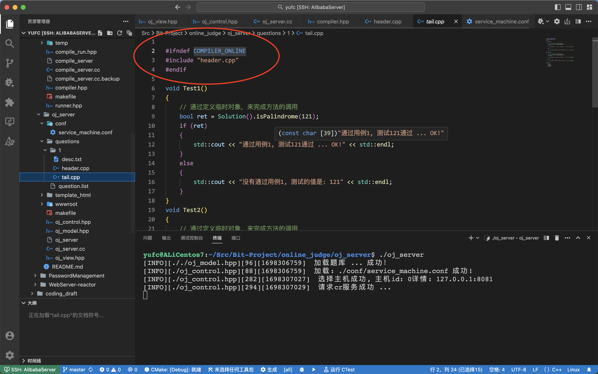

这个是要去掉的！所以我们调用g++的时候，要带上宏！

```cpp
execlp("g++", "g++", "-o", PathUtil::Exe(file_name).c_str(), PathUtil::Src(file_name).c_str(), "-std=c++11", "-D", "COMPILER_ONLINE", nullptr);
```

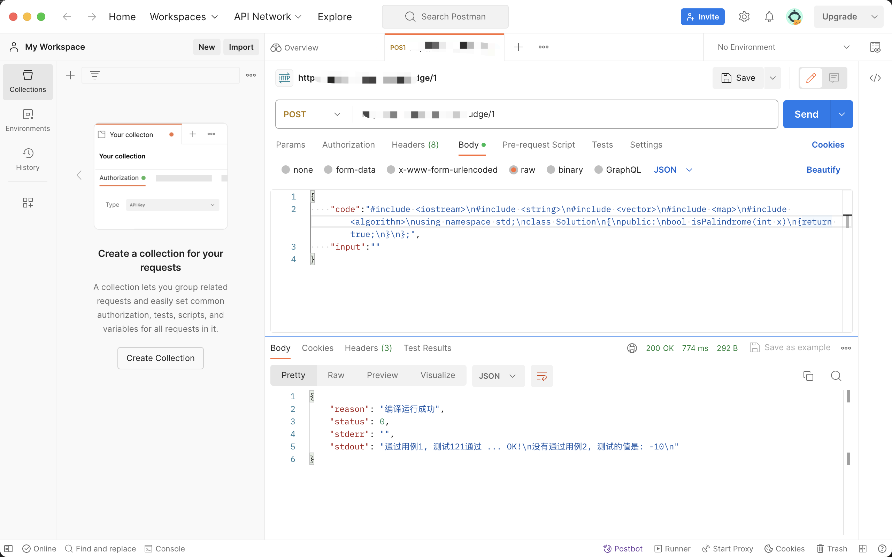

改了之后就没问题了。

## 15. 前端部分编写

### 15.1 准备知识

现在要写前端了，我们要先能写一个合格的前端，把代码提交上来试试才行，不然我们没法调试。

- 丐版的首页
- 所有题目的列表
- 指定题目的编写代码的页面+代码提交

后端开发需要关心前端页面？根本不需要，为什么我们要写它？如果不想写直接复制粘贴即可。

1. 任何项目，都要有前后端
2. 后端虽然不关心所谓的页面，但是需要了解一下前后端是如何交互的
3. 笔试面试，后端用不着前端，前端部分了解一下即可

编写页面的时候需要三剑客：html+css+js

### 15.2 开始操作

所谓的对样式进行调整，本质是对html中的标签的样式做调整

1. 选中标签
2. 设置样式

### 15.3 首页

```html
<!DOCTYPE html>
<html lang="en">

<head>
    <meta charset="UTF-8">
    <meta name="viewport" content="width=device-width, initial-scale=1.0">
    <title>这个我的个人OJ系统</title>
    <!-- 网页的样式 -->
    <style>
        * {
            /* 消除网页默认外边距 */
            margin: 0px;
            /* 消除网页的默认内边距 */
            padding: 0px;
        }

        html,
        body {
            width: 100%;
            height: 100%;
        }

        .container .navbar {
            width: 100%;
            height: 50px;
            background-color: black;
            /* 给父级标签设置overflow，取消后续float带来的影响 */
            overflow: hidden;
        }

        .container .navbar a {
            display: inline-block;
            /* 设置a标签的宽度 */
            width: 80px;
            /* 设置字体 */
            color: white;
            font-size: larger;
            /* 上下居中 */
            line-height: 50px;
            /* 文字和导航栏同样高度 */
            text-decoration: none;
            /* 设置文字居中 */
            text-align: center;
        }

        /* 设置鼠标事件 */
        .container .navbar a:hover {
            background-color: green;
        }

        .container .navbar .login {
            float: right;
        }

        .container .content {
            width: 800px;
            /* background-color: #ccc; */
            /* 整体居中 */
            margin: 0px auto;
            /* 设置文字居中 */
            text-align: center;
            /* 设置上外边距 */
            margin-top: 200px;
        }

        .container .content .font_ {
            /* 设置标签为块级元素，独占一行，可以设置高度宽度等属性 */
            display: block;
            /* 设置上外边距 */
            margin-top: 20px;
            /* 去掉下划线 */
            text-decoration: none;
        }
        
        /* Adjust the font size for the header */
        .container .content .font_:first-child {
            font-size: 40px; /* You can adjust the size as needed */
        }
        .container .content .font_:nth-child(2) {
            font-size: 28px; /* You can adjust the size as needed */
        }
    </style>
</head>

<body>
    <div class="container">
        <!-- 导航栏 功能不实现-->
        <div class="navbar">
            <a href="#">首页</a>
            <a href="/all_questions">题库</a>
            <a href="#">竞赛</a>
            <a href="#">讨论</a>
            <a href="#">求职</a>
            <a class="login" href="#">登录</a>
        </div>
        <!-- 网页的内容 -->
        <div class="content">
            <h1 class="font_">~~Welcome to OnlineJudge System~~</h1>
            <p class="font_">这个是我独立开发的在线OJ平台</p>
            <h2 class="font_">
                <a href="/all_questions">点击我开始编程啦～</a>
            </h2>
        </div>
    </div>
</body>

</html>
```

### 15.4 题目列表

```html
<!DOCTYPE html>
<html lang="en">

<head>
    <meta charset="UTF-8">
    <meta name="viewport" content="width=device-width, initial-scale=1.0">
    <title>在线OJ-题目列表</title>
    <style>
        * {
            /* 消除网页默认外边距 */
            margin: 0px;
            /* 消除网页的默认内边距 */
            padding: 0px;
        }

        html,
        body {
            width: 100%;
            height: 100%;
        }

        .container .navbar {
            width: 100%;
            height: 50px;
            background-color: black;
            /* 给父级标签设置overflow，取消后续float带来的影响 */
            overflow: hidden;
        }

        .container .navbar a {
            display: inline-block;
            /* 设置a标签的宽度 */
            width: 80px;
            /* 设置字体 */
            color: white;
            font-size: larger;
            /* 上下居中 */
            line-height: 50px;
            /* 文字和导航栏同样高度 */
            text-decoration: none;
            /* 设置文字居中 */
            text-align: center;
        }

        /* 设置鼠标事件 */
        .container .navbar a:hover {
            background-color: green;
        }

        .container .navbar .login {
            float: right;
        }

        .container .question_list {
            padding: 50px;
            width: 800px;
            height: 630px;
            margin: 0px auto;
            /* background-color: #ccc; */
            text-align: center;
        }
        .container .question_list table {
            margin-top: 30px;
            width: 100%;
            font-size: large;
            font-family: 'Times New Roman', Times, serif;
            background-color: #f8f8f8;
        }
        .container .question_list h1 {
            font-size: 30px;
            color: black;
        }
        .container .question_list table .item {
            width: 100px;
            height: 30px;
            padding-top: 7px;
            padding-bottom: 7px;
            font-size: large;
            font-family: 'Times New Roman', Times, serif;
        }
        .container .question_list table .item a:hover {
            color: blue;
            font-weight: bold;
        }
        .container .footer {
            width: 100%;
            height: 100%;
            text-align: center;
            color: #ccc;
            line-height: 50px;
        }
    </style>
</head>

<body>
    <div class="container">
        <div class="navbar">
            <a href="/">首页</a>
            <a href="/all_questions">题库</a>
            <a href="#">竞赛</a>
            <a href="#">讨论</a>
            <a href="#">求职</a>
            <a class="login" href="#">登录</a>
        </div>
        <div class="question_list">
            <h1>OnlineJudge题目列表</h1>
            <table>
                <tr>
                    <th class="item">题目编号</th>
                    <th class="item">题目标题</th>
                    <th class="item">题目难度</th>
                </tr>
                {{#question_list}}
                <tr>
                    <td class="item">{{number}}</td>
                    <td class="item"><a href="/question/{{number}}">{{title}}</a></td>
                    <td class="item">{{star}}</td>
                </tr>
                {{/question_list}}
            </table>
        </div>
        <div class="footer">
            <!-- <hr> -->
            <h4>@作者: Yufc</h4>
        </div>
    </div>

</body>

</html>
```

### 15.5 Ace在线编辑器构建单个题目列表（直接复制粘贴即可）

```html
<!DOCTYPE html>
<html lang="en">

<head>
    <meta charset="UTF-8">
    <meta http-equiv="X-UA-Compatible" content="IE=edge">
    <meta name="viewport" content="width=device-width, initial-scale=1.0">
    <title>{{number}}.{{title}}</title>
    <!-- 引入ACE插件 -->
    <!-- 官网链接:https://ace.c9.io/ -->
    <!-- CDN链接:https://cdnjs.com/libraries/ace -->
    <!-- 使用介绍:https://www.iteye.com/blog/ybc77107-2296261 -->
    <!-- https://justcode.ikeepstudying.com/2016/05/ace-editor-
%E5%9C%A8%E7%BA%BF%E4%BB%A3%E7%A0%81%E7%BC%96%E8%BE%91%E6%9E%81%E5%85%B6%E9%AB%98%E4%BA%AE/
-->
    <!-- 引入ACE CDN -->
    <script src="https://cdnjs.cloudflare.com/ajax/libs/ace/1.2.6/ace.js" type="text/javascript"
        charset="utf-8"></script>
    <script src="https://cdnjs.cloudflare.com/ajax/libs/ace/1.2.6/ext-language_tools.js" type="text/javascript"
        charset="utf-8"></script>
    <!-- 引入jquery CDN -->
    <script src="http://code.jquery.com/jquery-2.1.1.min.js"></script>
    <style>
        * {
            margin: 0;
            padding: 0;
        }

        html,
        body {
            width: 100%;
            height: 100%;
        }

        .container .navbar {
            width: 100%;
            height: 50px;
            background-color: black;
            /* 给父级标签设置overflow，取消后续float带来的影响 */
            overflow: hidden;
        }

        .container .navbar a {
            /* 设置a标签是行内块元素，允许你设置宽度 */
            display: inline-block;
            /* 设置a标签的宽度,a标签默认行内元素，无法设置宽度 */
            width: 80px;
            /* 设置字体颜色 */
            color: white;
            /* 设置字体的大小 */
            font-size: large;
            /* 设置文字的高度和导航栏一样的高度 */
            line-height: 50px;
            /* 去掉a标签的下划线 */
            text-decoration: none;
            /* 设置a标签中的文字居中 */
            text-align: center;
        }

        /* 设置鼠标事件 */
        .container .navbar a:hover {
            background-color: green;
        }

        .container .navbar .login {
            float: right;
        }

        .container .part1 {
            width: 100%;
            height: 600px;
            overflow: hidden;
        }

        .container .part1 .left_desc {
            width: 50%;
            height: 600px;
            float: left;
            overflow: scroll;
        }

        .container .part1 .left_desc h3 {
            padding-top: 10px;
            padding-left: 10px;
        }

        .container .part1 .left_desc pre {
            padding-top: 10px;
            padding-left: 10px;
            font-size: medium;
            font-family: 'Gill Sans', 'Gill Sans MT', Calibri, 'Trebuchet MS', sans-serif;
        }

        .container .part1 .right_code {
            width: 50%;
            float: right;
        }

        .container .part1 .right_code .ace_editor {
            height: 600px;
        }

        .container .part2 {
            width: 100%;
            /* height: 185px;
            height: 100%; */
            overflow: hidden;
            /* background-color: #e2e2e2; */
        }

        .container .part2 .result {
            width: 300px;
            float: left;
        }

        .container .part2 .btn-submit {
            width: 120px;
            height: 50px;
            font-size: large;
            float: right;
            background-color: #0aa610;
            color: #FFF;
            /* 给按钮带上圆角 */
            border-radius: 1ch;
            border: 0px;
            margin-top: 10px;
            margin-right: 10px;
        }

        .container .part2 button:hover {
            background-color: rgb(1, 91, 1);
        }

        .container .part2 .result {
            margin-top: 15px;
            margin-left: 15px;
        }

        .container .part2 .result pre {
            font-size: large;
        }
    </style>
</head>

<body>
    <div class="container">
        <!-- 导航栏， 功能不实现-->
        <div class="navbar">
            <a href="/">首页</a>
            <a href="/all_questions">题库</a> <a href="#">竞赛</a>
            <a href="#">讨论</a>
            <a href="#">求职</a>
            <a class="login" href="#">登录</a>
        </div>
        <!-- 左右呈现，题目描述和预设代码 -->
        <div class="part1">
            <div class="left_desc">
                <h3><span id="number">{{number}}</span>.{{title}}_{{star}}</h3>
                <pre>{{desc}}</pre>
            </div>
            <div class="right_code">
                <pre id="code" class="ace_editor"><textarea class="ace_text-input">{{pre_code}}</textarea></pre>
            </div>
        </div>
        <!-- 提交并且得到结果，并显示 -->
        <div class="part2">
            <div class="result"></div>
            <button class="btn-submit" onclick="submit()">提交代码</button>
        </div>
    </div>
    <script>
        //初始化对象
        editor = ace.edit("code");
        //设置风格和语言(更多风格和语言，请到github上相应目录查看)
        // 主题大全:http://www.manongjc.com/detail/25-cfpdrwkkivkikmk.html 
        editor.setTheme("ace/theme/textmate");
        editor.session.setMode("ace/mode/c_cpp");
        // 字体大小
        editor.setFontSize(16);
        // 设置默认制表符的大小: 
        editor.getSession().setTabSize(4);
        // 设置只读(true时只读，用于展示代码) 
        editor.setReadOnly(false);
        // 启用提示菜单 
        ace.require("ace/ext/language_tools");
        editor.setOptions({
            enableBasicAutocompletion: true,
            enableSnippets: true,
            enableLiveAutocompletion: true
        });
        function submit() {
            // alert("嘿嘿!");
            // 1. 收集当前页面的有关数据, 1. 题号 2.代码
            var code = editor.getSession().getValue();
            // console.log(code);
            var number = $(".container .part1 .left_desc h3 #number").text();
            // console.log(number);
            var judge_url = "/judge/" + number;
            // console.log(judge_url);
            // 2. 构建json，并通过ajax向后台发起基于http的json请求
            $.ajax({
                method: 'Post', // 向后端发起请求的方式
                url: judge_url, // 向后端指定的url发起请求
                dataType: 'json', // 告知server，我需要什么格式
                contentType: 'application/json;charset=utf-8', // 告知server，我给你的是什么
                data: JSON.stringify({
                    'code': code,
                    'input': ''
                }),
                success: function (data) { //成功得到结果
                    // console.log(data);
                    show_result(data);
                }
            });
            // 3. 得到结果，解析并显示到 result中 
            function show_result(data) {
                // console.log(data.status);
                // console.log(data.reason);
                // 拿到result结果标签
                var result_div = $(".container .part2 .result"); // 清空上一次的运行结果
                result_div.empty();
                // 首先拿到结果的状态码和原因结果 
                var _status = data.status; 
                var _reason = data.reason;
                var reason_lable = $("<p>", {
                    text: _reason
                });
                reason_lable.appendTo(result_div);
                if (status == 0) {
                    // 请求是成功的，编译运行过程没出问题，但是结果是否通过看测试用例的结果 
                    var _stdout = data.stdout;
                    var _stderr = data.stderr;
                    var stdout_lable = $("<pre>", {
                        text: _stdout
                    });
                    var stderr_lable = $("<pre>", {
                        text: _stderr
                    })
                    stdout_lable.appendTo(result_div);
                    stderr_lable.appendTo(result_div);
                }
                else {
                    // 编译运行出错,do nothing
                }
            }
        }
    </script>
</body>

</html>
```


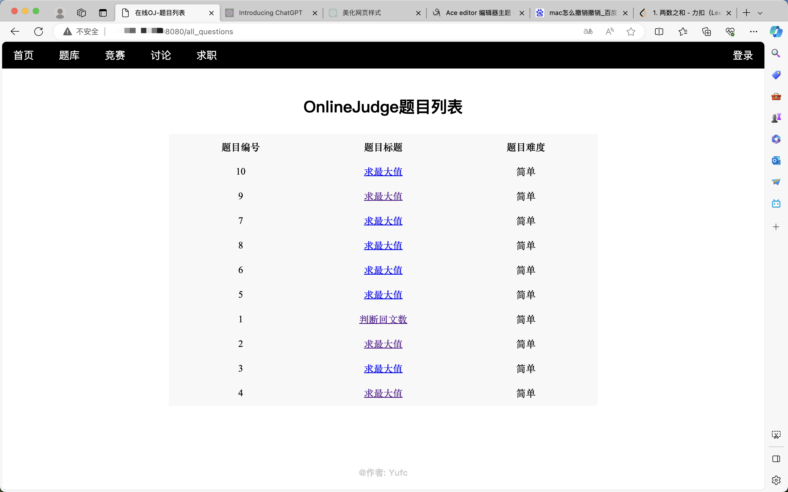

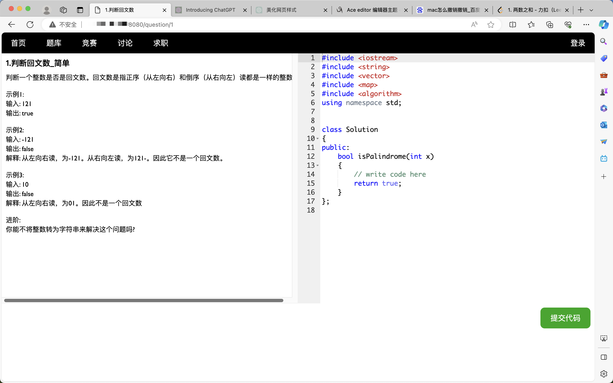

## 16. 综合调试

### 16.1 解决题目列表乱序问题

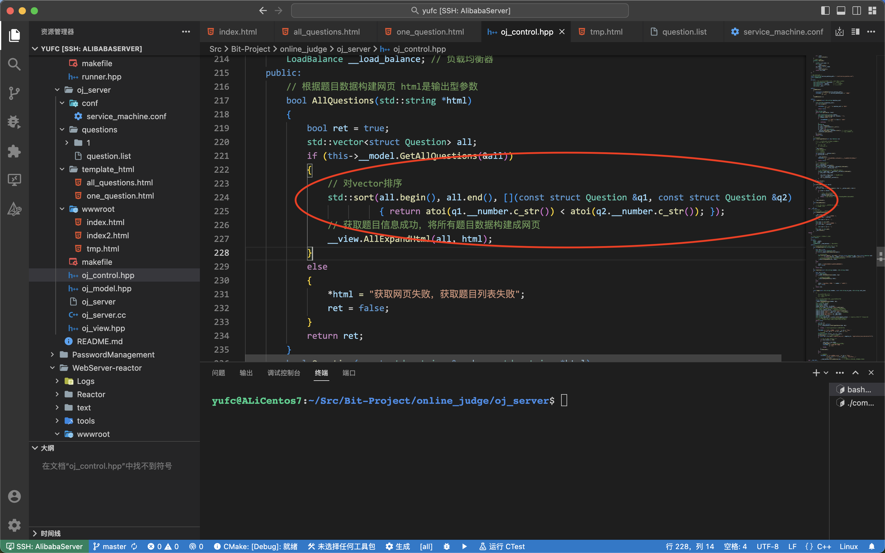

### 16.2 解决当所有主机离线了，然后同上线的问题

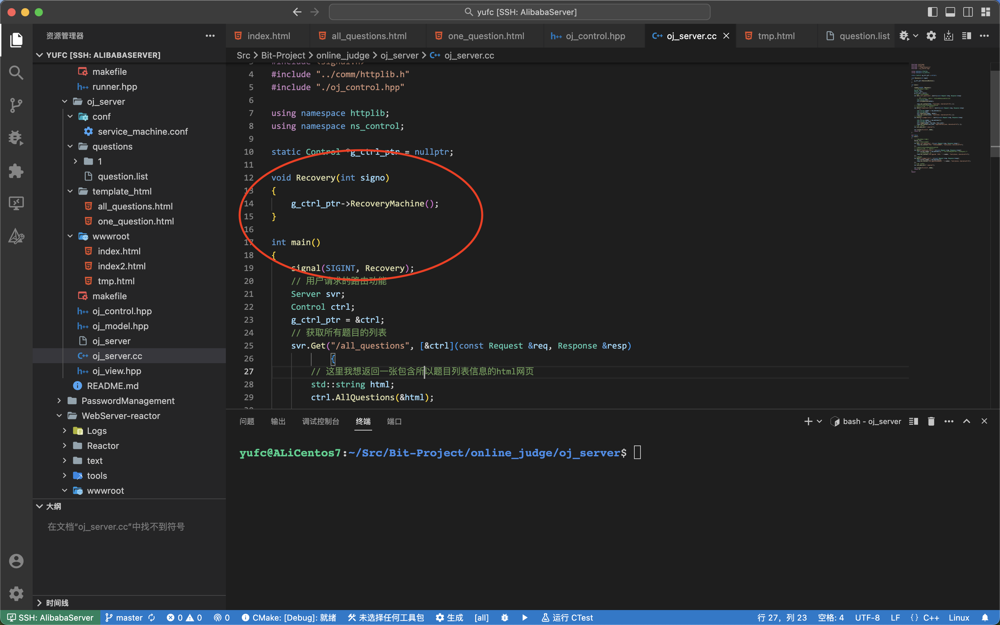


所有主机挂掉之后。先重新启动所有cr模块。

在oj_server的部分，^C一下，就能重新上线所有主机！

还是改成^/吧，改成三号信号，这个不太好用。

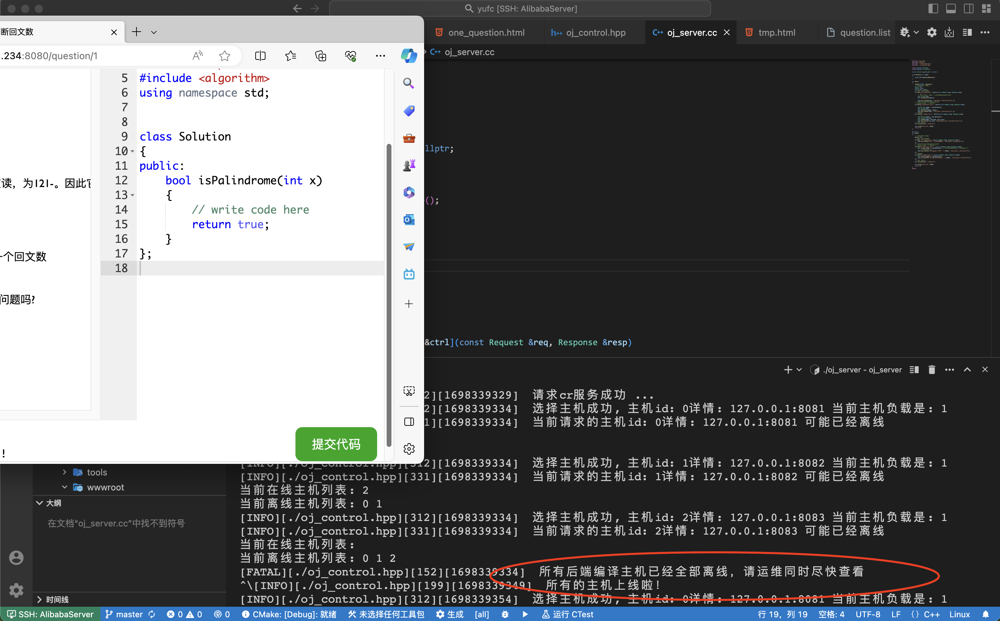

## 17. 结项

### 17.1 项目扩展思路

1. 给予注册和登录的录题功能
2. 业务扩展，把自己的博客接入进去
3. 把编译服务部署到docker上
4. 目前后端的cr服务，我们使用的是http方式请求（仅仅是因为请求），我们可以改成远程过程调用，推荐rest_rpc，替换我们httplib。
5. 功能上完善，判断一道题全部正确后，自动下一道题
6. navbar中的功能都可以一个个去实现

### 17.2 Makefile的整体构建

```makefile
.PHONY:all
all:
	@cd compile_server;\
	make;\
	cd ..;\
	cd oj_server;\
	make;\
	cd ..;\


.PHONY:make_output
make_output:
	mkdir -p make_output/compile_server;\
	mkdir -p make_output/oj_server;\
	cp -rf ./compile_server/compile_server make_output/compile_server/;\
	cp -rf ./compile_server/temp make_output/compile_server/;\
	cp -rf ./oj_server/conf make_output/oj_server/;\
	cp -rf ./oj_server/questions make_output/oj_server/;\
	cp -rf ./oj_server/template_html make_output/oj_server/;\
	cp -rf ./oj_server/wwwroot make_output/oj_server/;\
	cp -rf ./oj_server/oj_server make_output/oj_server/;\


.PHONY:clean
clean:
	@cd compile_server;\
	make clean;\
	cd ..;\
	cd oj_server;\
	make clean;\
	cd ..;\
	rm -rf make_output
```

make_output目录下就是我们要发布的内容了。
